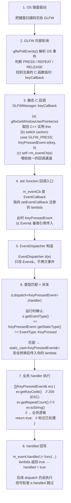
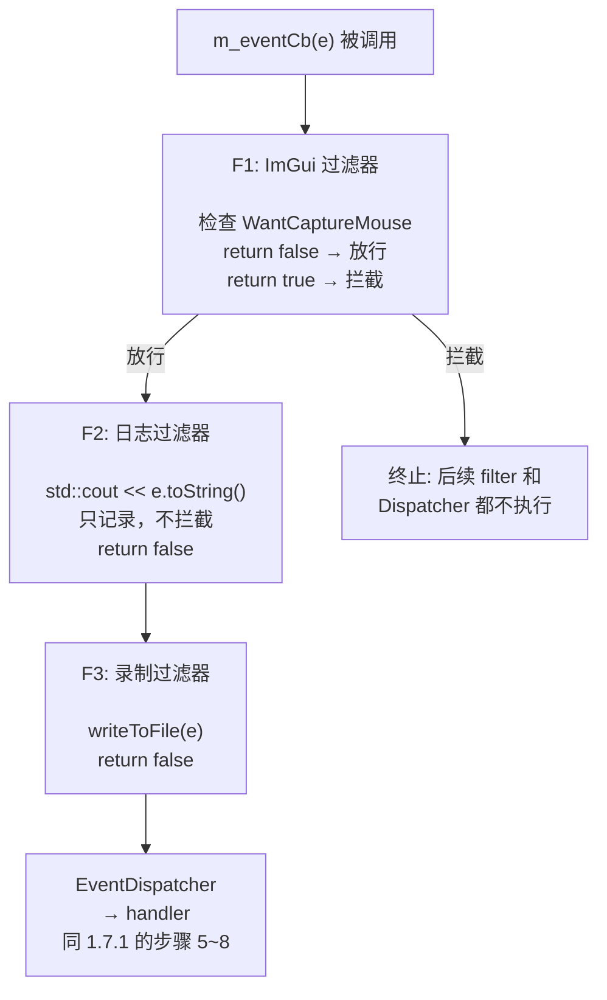
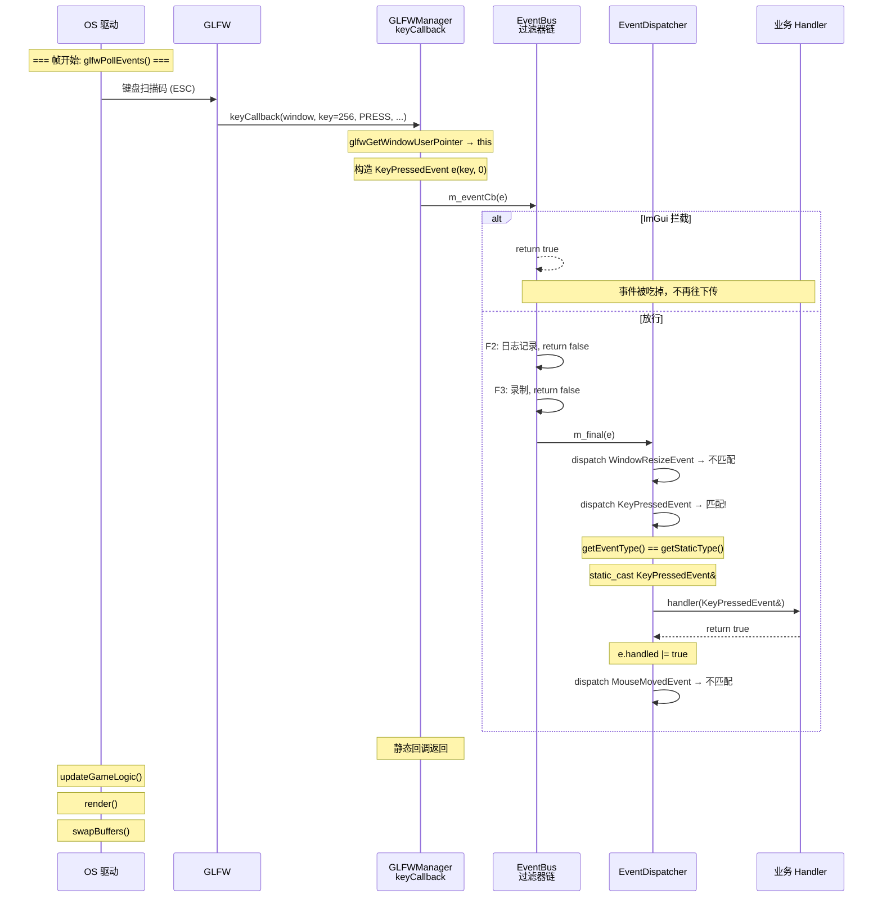
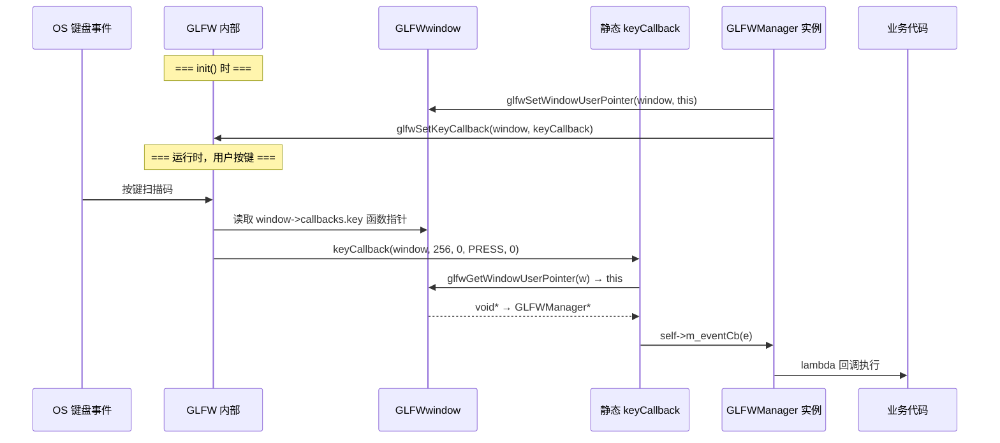

# 进阶 01 · 事件系统设计

> 目标：基础篇里我们用了「每种事件一个 `std::function`」的简单做法。事件一多就爆炸——
> 本篇设计一套统一的 **Event 基类 + EventDispatcher**，把所有窗口/输入事件汇成一条统一通道。
> 这是工业引擎（Hazel、Unity、Unreal 的 UMG）的通用模式。

---

## 1.1 旧方案的瓶颈

基础篇的 `GLFWManager` 长这样：

```cpp
using KeyCallback    = std::function<void(int, int, int, int)>;
using ResizeCallback = std::function<void(int, int)>;
void setKeyCallback(KeyCallback);
void setResizeCallback(ResizeCallback);
// 加鼠标移动 → 再加一个 MouseMovedCallback
// 加鼠标点击 → 再加一个 MouseButtonCallback
// 加鼠标滚轮 → 再加一个 MouseScrolledCallback
// 加窗口关闭 → 再加一个 WindowCloseCallback
// ...
```

问题：

1. **成员变量和接口爆炸**：N 种事件 = N 个回调类型 + N 个 setter + N 个成员。
2. **处理分散**：业务代码要在 N 个 lambda 里分别写逻辑，相关逻辑被割裂。
3. **没法统一拦截**：想做「全局事件日志」「事件录制回放」「事件优先级」，每个回调都要单独改。

---

## 1.2 新方案：统一的事件通道

核心思想：**所有事件都是一种「Event」，沿同一条管道流动。**

```
   GLFW 回调                    你的引擎
   ┌─────────┐                 ┌──────────────────────┐
   │ 按键    │──┐              │  EventDispatcher     │
   │ 鼠标    │──┼──构造成──►   │   .dispatch(event)   │──► 各个 handler
   │ 缩放    │──┤   Event      │                      │
   │ 关闭    │──┘              └──────────────────────┘
   └─────────┘
```

每个 handler 注册自己关心的事件类型，Dispatcher 把事件分发给匹配的 handler。

---

## 1.3 设计 Event 类型体系

采用经典的「基类 + 多类型枚举」结构（Hazel 风格）：

```cpp
// Event.h
#pragma once
#include <string>
#include <functional>

// 所有事件的分类标签（位掩码，方便一个 handler 订阅多类）
enum class EventCategory : int {
    None         = 0,
    Application  = 1 << 0,   // 窗口关闭、刷新
    Input        = 1 << 1,   // 任何输入
    Keyboard     = 1 << 2,
    Mouse        = 1 << 3,
    MouseButton  = 1 << 4,
};

// 事件类型枚举
enum class EventType {
    None = 0,
    WindowClose, WindowResize, WindowFocus, WindowMoved,
    KeyPressed, KeyReleased, KeyTyped,
    MouseButtonPressed, MouseButtonReleased, MouseMoved, MouseScrolled
};

#define EVENT_CLASS_TYPE(type) static EventType getStaticType() { return EventType::type; } \
                               virtual EventType getEventType() const override { return getStaticType(); } \
                               virtual const char* getName() const override { return #type; }

#define EVENT_CLASS_CATEGORY(category) virtual int getCategoryFlags() const override { return (int)category; }

// 抽象基类
class Event {
public:
    bool handled = false;   // handler 处理后置 true，阻止继续传播

    virtual EventType getEventType() const = 0;
    virtual const char* getName() const = 0;
    virtual int getCategoryFlags() const = 0;
    virtual std::string toString() const { return getName(); }

    bool isInCategory(EventCategory c) const {
        return getCategoryFlags() & (int)c;
    }
};

// 用位运算符支持 EventCategory 的 | 操作
inline int operator|(EventCategory a, EventCategory b) {
    return (int)a | (int)b;
}
```

> 💡 这套宏（`EVENT_CLASS_TYPE`）看着花哨，本质是省去每个子类重复写三个一模一样的虚函数。
> 如果你不爱宏，C++ 起也可以手写，只是啰嗦。

### 具体事件子类

```cpp
// KeyEvent.h
class KeyEvent : public Event {        // 键盘事件基类
public:
    int getKeyCode() const { return m_keyCode; }
    EVENT_CLASS_CATEGORY(EventCategory::Keyboard | EventCategory::Input)
protected:
    KeyEvent(int keycode) : m_keyCode(keycode) {}
    int m_keyCode;
};

class KeyPressedEvent : public KeyEvent {
public:
    KeyPressedEvent(int keycode, int repeatCount)
        : KeyEvent(keycode), m_repeatCount(repeatCount) {}
    int getRepeatCount() const { return m_repeatCount; }
    std::string toString() const override {
        return "KeyPressed: " + std::to_string(m_keyCode) +
               " (" + std::to_string(m_repeatCount) + " repeats)";
    }
    EVENT_CLASS_TYPE(KeyPressed)
private:
    int m_repeatCount;
};

class KeyReleasedEvent : public KeyEvent {
public:
    KeyReleasedEvent(int keycode) : KeyEvent(keycode) {}
    std::string toString() const override { return "KeyReleased: " + std::to_string(m_keyCode); }
    EVENT_CLASS_TYPE(KeyReleased)
};
```

类似的你可以写出 `WindowResizeEvent`、`MouseButtonEvent`、`MouseMovedEvent`……模式完全一样：
继承合适的中间基类、填 `EVENT_CLASS_TYPE` 宏、加自己的数据字段。

```cpp
class WindowResizeEvent : public Event {
public:
    WindowResizeEvent(int w, int h) : m_width(w), m_height(h) {}
    int getWidth()  const { return m_width; }
    int getHeight() const { return m_height; }
    std::string toString() const override {
        return "WindowResize: " + std::to_string(m_width) + ", " + std::to_string(m_height);
    }
    EVENT_CLASS_TYPE(WindowResize)
    EVENT_CLASS_CATEGORY(EventCategory::Application)
private:
    int m_width, m_height;
};
```

---

## 1.4 EventDispatcher：类型安全的派发

一个 `Event` 进来，handler 怎么知道它是 `KeyPressedEvent` 还是 `WindowResizeEvent`？
用 `dynamic_cast` 太丑且慢。我们写一个模板化的 Dispatcher：

```cpp
// 在 Event.h 里
class EventDispatcher {
public:
    EventDispatcher(Event& event) : m_event(event) {}

    // 模板：只匹配指定类型，传入一个返回 bool 的 handler
    template<typename T, typename F>
    bool dispatch(const F& func) {
        if (m_event.getEventType() == T::getStaticType()) {
            m_event.handled |= func(static_cast<T&>(m_event));  // |= 而非 =：一旦标记 handled 就保持，不被后续 false 清掉
            return true;
        }
        return false;
    }
private:
    Event& m_event;
};
```

用法：

```cpp
void onEvent(Event& e) {
    EventDispatcher dispatcher(e);
    dispatcher.dispatch<WindowResizeEvent>([](WindowResizeEvent& ev) {
        glViewport(0, 0, ev.getWidth(), ev.getHeight());
        return true;    // 标记已处理
    });
    dispatcher.dispatch<KeyPressedEvent>([](KeyPressedEvent& ev) {
        if (ev.getKeyCode() == GLFW_KEY_ESCAPE) { /* 关窗 */ }
        return false;
    });
}
```

`dispatch<T>` 内部用编译期 `T::getStaticType()` 比较类型，匹配则把 `Event&` 安全 `static_cast` 成 `T&`，
调用你的 handler。**类型安全、零虚函数开销（除了初始比较）。**

> 💡 这套纯逻辑（类型枚举、分类位掩码、Dispatcher 派发）完全不依赖窗口，非常适合写单元测试——
> 见 [进阶篇 08 测试与验证](08-测试与验证.md)。

---

## 1.5 接入 GLFWManager

把基础篇的「N 个 `std::function`」替换成「一个事件回调 + Dispatcher」：

```cpp
// GLFWManager.h 里改成：
using EventCallback = std::function<void(Event&)>;
// ...只保留一个回调成员
EventCallback m_eventCb;
public:
    void setEventCallback(EventCallback cb) { m_eventCb = std::move(cb); }
```

`.cpp` 的静态回调改成「构造对应 Event → 喂给 `m_eventCb`」：

```cpp
void GLFWManager::keyCallback(GLFWwindow* w, int key, int sc, int action, int mods) {
    auto* self = static_cast<GLFWManager*>(glfwGetWindowUserPointer(w));
    if (!self || !self->m_eventCb) return;

    switch (action) {
        case GLFW_PRESS:   { KeyPressedEvent  e(key, 0);    self->m_eventCb(e); break; }
        case GLFW_RELEASE: { KeyReleasedEvent e(key);       self->m_eventCb(e); break; }
        case GLFW_REPEAT:  { KeyPressedEvent  e(key, 1);    self->m_eventCb(e); break; }
    }
}

void GLFWManager::framebufferSizeCallback(GLFWwindow* w, int width, int height) {
    auto* self = static_cast<GLFWManager*>(glfwGetWindowUserPointer(w));
    if (!self) return;
    self->m_width = width;
    self->m_height = height;
    if (self->m_eventCb) {
        WindowResizeEvent e(width, height);
        self->m_eventCb(e);
    }
}
```

业务侧注册**一个**回调，内部用 Dispatcher 分流：

```cpp
window.setEventCallback([](Event& e) {
    EventDispatcher d(e);
    d.dispatch<WindowResizeEvent>([](WindowResizeEvent& ev){
        glViewport(0, 0, ev.getWidth(), ev.getHeight());
        return true;
    });
    d.dispatch<KeyPressedEvent>([&](KeyPressedEvent& ev){
        if (ev.getKeyCode() == GLFW_KEY_ESCAPE) window.setShouldClose(true);
        return false;
    });
});
```

无论未来加多少种事件，`GLFWManager` 的接口**只增长对应的 GLFW 回调注册，对外的 `Event` 通道始终是一个**。

---

## 1.6 进阶特性：事件传播与拦截

`Event::handled` 字段让事件可以「被吃掉」。一个常见模式：

```cpp
// ImGui 先吃事件，没吃透的才给游戏
window.setEventCallback([](Event& e) {
    EventDispatcher d(e);
    d.dispatch<MouseButtonPressedEvent>([](MouseButtonPressedEvent& ev){
        if (ImGui::GetIO().WantCaptureMouse) {
            ev.handled = true;   // 鼠标在 ImGui 面板上，游戏不要响应
            return true;
        }
        return false;
    });
    // ...没被标记 handled 的事件继续传给游戏逻辑
    application->onEvent(e);
});
```

这是 [05 篇 ImGui 集成](05-集成ImGui.md) 的核心机制——ImGui 和游戏共享同一套事件。

---

## 1.7 完整调用链路：从 OS 到业务 handler

前面 1.3~1.6 分别讲了 Event、Dispatcher、GLFWManager 接入、EventBus。
这里以「用户按下 ESC 键」为例，把整条链路串起来。

### 1.7.1 简单路径（8 步流程图）



> 💡 第 4 步传 `Event&`（基类引用），第 6 步用 `static_cast` 恢复成子类引用。
> 这个 cast 不是 `dynamic_cast`——先通过 `getEventType()` 在**运行时确认**类型，
> 再做**零开销**的静态转换。确认在前，转换在后，是安全的。

### 1.7.2 带过滤器链的路径（EventBus 中间件）

如果你用了练习 3 的 `EventBus`，第 4 步调用 `m_eventCb(e)` 后会**先过过滤器链**，再到 Dispatcher：



**执行规则：**

```cpp
for (auto& filter : m_filters) {
    if (filter(e)) return;   // 任何一个返回 true → 整条链路终止
}
if (m_final) m_final(e);     // 全部放行 → 交给最终 handler
```

- `return true`：吃掉事件（如 ImGui `WantCaptureMouse`）
- `return false`：放行，传给下一个 filter

### 1.7.3 完整时序图



### 1.7.4 每一步的持有关系

| 步骤 | 谁持有数据 | 生命周期 | 说明 |
|------|-----------|---------|------|
| 2 | GLFW 事件队列 | pollEvents 执行期间 | OS 事件被 GLFW 内部结构持有 |
| 3 | 局部变量 `KeyPressedEvent e` | 栈帧内 | switch case 里构造，传出 `Event&` |
| 4 | `std::function` | 取决于 lambda 捕获 | 传引用给 lambda，**不拷贝** Event |
| 5 | Dispatcher 只存 `Event&` | 栈变量 | 不持有 Event，仅仅是引用包装 |
| 6 | 仍是同一个 Event | 同步骤 3 | `static_cast` 不创建新对象 |
| 7 | handler 中的引用 | lambda 体内 | 看到的是**同一个** `e` |

### 1.7.5 关键要点

1. **Event 在栈上**：`KeyPressedEvent e` 是局部变量，整个调用链同步完成——无生命周期问题。
2. **零堆分配**：Event 构造、Dispatcher 构造、static_cast 都不涉及 `new`/`malloc`。
3. **同步执行**：`m_eventCb(e)` 同步调用，handler 执行完才返回。窗口/输入事件必须当场处理。
4. **handled 共享**：全链路传同一个 Event 引用，任何 filter 或 handler 修改 `handled`，下游立即可见。
5. **dispatch 顺序 = 优先级**：先 `dispatch<WindowResizeEvent>` 后 `dispatch<KeyPressedEvent>` → resize 优先处理。

### 1.7.6 C 函数指针如何调进 C++：keyCallback 的桥接机制

`GLFWManager::keyCallback` 是 `static` 成员函数，本质上是一个**C 函数指针**（没有隐式 `this`）。
GLFW 在内部这样调用它：

```
GLFW 内部 (glfwPollEvents 中):

    GLFWwindow* window;
    // 1. GLFW 处理 OS 键盘事件，拿到 key、scancode、action、mods
    // 2. 从 window 结构体里取出之前注册的回调函数指针
    // 3. 直接调用:

    window->callbacks.key(        // ← 这就是 keyCallback 的函数指针
        window,                   //    GLFW 把 window 作为第一个参数传进来
        key, scancode, action, mods
    );
```

这个 `window->callbacks.key` 就是我们在 `init()` 里通过 `glfwSetKeyCallback(m_window, keyCallback)` 注册进去的。

**关键问题：** 这是一个 C 函数调用，它不知道 `GLFWManager` 实例在哪里。
但 `keyCallback` 是 C++ 类的静态成员函数，它需要一个 `this` 指针才能干活。

**解决方案：GLFW 的 user pointer 机制。**

```cpp
// init() 里，创建窗口之后立即：
glfwSetWindowUserPointer(m_window, this);
//                                ^^^^
//          把 GLFWManager* 存进 GLFWwindow 内部的一个 void* 字段

glfwSetKeyCallback(m_window, keyCallback);
//                          ^^^^^^^^^^^
//          把静态成员函数的地址注册为回调
```

当 OS 按键事件发生时，GLFW 调用 `keyCallback`，第一条语句就是取回 `this`：

```cpp
void GLFWManager::keyCallback(GLFWwindow* w, int key, int sc,
                              int action, int mods) {
    // w 就是 GLFW 传过来的 window —— 和 init() 里的是同一个指针
    auto* self = static_cast<GLFWManager*>(
                     glfwGetWindowUserPointer(w));
    //                 ↑ 从 GLFWwindow 里取出我们之前塞进去的 this
    if (!self || !self->m_eventCb) return;

    // 现在 self 就是 GLFWManager 实例，可以访问成员了
    switch (action) {
    case GLFW_PRESS:
        KeyPressedEvent e(key, 0);
        self->m_eventCb(e);   // ← 调成员变量 m_eventCb
        break;
    // ...
    }
}
```

**整条链路用一张图概括：**



> 💡 **一句话总结：** `glfwSetWindowUserPointer` 把 C++ 实例塞进 C 结构体，
> `keyCallback` 的 static 属性让它能当 C 函数指针用，进去第一件事就是取回实例。
> 这套「C 回调 → user pointer → C++ 实例」的模式是所有 C 库 C++ 封装的通用范式。

---
## 1.8 什么时候用事件，什么时候用轮询？

| 场景 | 推荐 |
|---|---|
| 「按下瞬间」触发（跳、开火、暂停） | **事件**（`KeyPressedEvent`，只触发一次） |
| 「持续按住」状态（移动、转向） | **轮询**（`isKeyPressed`，每帧查） |
| 鼠标点击 UI | **事件** |
| 鼠标拖拽 3D 物体 | 两者结合：事件记录按下/松开，轮询读位置 |

记住：**事件是「边沿触发」，轮询是「电平触发」。** [03 篇](03-输入系统.md) 会深入。

---

## 1.9 小结

- 把每种事件一个回调，升级成「统一 Event 通道 + Dispatcher」，接口稳定、可扩展、可拦截。
- `Event` 基类 + 类型枚举 + 分类位掩码，是工业引擎通用骨架。
- `EventDispatcher::dispatch<T>` 用编译期类型匹配，类型安全且高效。
- `handled` 字段实现事件传播控制（ImGui / UI 拦截游戏输入的基础）。

---

## 🔧 练习

1. 自己补全 `MouseMovedEvent`、`MouseButtonPressedEvent`、`WindowCloseEvent` 三个类。
2. 给 `GLFWManager` 加上 `glfwSetCursorPosCallback`、`glfwSetMouseButtonCallback`、`glfwSetWindowCloseCallback`，
   把它们都翻译成对应 Event 喂给 `m_eventCb`。
3. （进阶）实现一个「事件过滤器」：在 Dispatcher 之前加一个链，允许中间件按顺序拦截事件（类似中间件模式）。

## 📝 参考答案

### 1. 补全 `MouseMovedEvent`、`MouseButtonPressedEvent`、`WindowCloseEvent`

```cpp
class MouseMovedEvent : public Event {
public:
    MouseMovedEvent(float x, float y) : m_x(x), m_y(y) {}
    float getX() const { return m_x; }
    float getY() const { return m_y; }
    std::string toString() const override {
        return "MouseMoved: " + std::to_string(m_x) + ", " + std::to_string(m_y);
    }
    EVENT_CLASS_TYPE(MouseMoved)
    EVENT_CLASS_CATEGORY(EventCategory::Mouse | EventCategory::Input)
private:
    float m_x, m_y;
};

class MouseButtonEvent : public Event {
public:
    int getButton() const { return m_button; }
    EVENT_CLASS_CATEGORY(EventCategory::Mouse | EventCategory::Input | EventCategory::MouseButton)
protected:
    MouseButtonEvent(int button) : m_button(button) {}
    int m_button;
};

class MouseButtonPressedEvent : public MouseButtonEvent {
public:
    MouseButtonPressedEvent(int button) : MouseButtonEvent(button) {}
    std::string toString() const override {
        return "MouseButtonPressed: " + std::to_string(m_button);
    }
    EVENT_CLASS_TYPE(MouseButtonPressed)
};

class WindowCloseEvent : public Event {
public:
    WindowCloseEvent() = default;
    std::string toString() const override { return "WindowClose"; }
    EVENT_CLASS_TYPE(WindowClose)
    EVENT_CLASS_CATEGORY(EventCategory::Application)
};
```

### 2. 注册三类 GLFW 回调并翻译成 Event

```cpp
// init() 里：
glfwSetCursorPosCallback(m_window, cursorPosCallback);
glfwSetMouseButtonCallback(m_window, mouseButtonCallback);
glfwSetWindowCloseCallback(m_window, windowCloseCallback);

void GLFWManager::cursorPosCallback(GLFWwindow* w, double x, double y) {
    auto* self = static_cast<GLFWManager*>(glfwGetWindowUserPointer(w));
    if (self && self->m_eventCb) { MouseMovedEvent e((float)x, (float)y); self->m_eventCb(e); }
}
void GLFWManager::mouseButtonCallback(GLFWwindow* w, int button, int action, int) {
    auto* self = static_cast<GLFWManager*>(glfwGetWindowUserPointer(w));
    if (!self || !self->m_eventCb) return;
    if (action == GLFW_PRESS)   { MouseButtonPressedEvent e(button); self->m_eventCb(e); }
    // RELEASE 同理：MouseButtonReleasedEvent
}
void GLFWManager::windowCloseCallback(GLFWwindow* w) {
    auto* self = static_cast<GLFWManager*>(glfwGetWindowUserPointer(w));
    if (self && self->m_eventCb) { WindowCloseEvent e; self->m_eventCb(e); }
}
```

### 3.（进阶）事件过滤器（中间件链）

```cpp
using EventFilter = std::function<bool(Event&)>;   // 返回 true = 拦截，不再传

class EventBus {
    std::vector<EventFilter> m_filters;
    EventCallback            m_final;
public:
    void addFilter(EventFilter f) { m_filters.push_back(std::move(f)); }
    void setHandler(EventCallback h) { m_final = std::move(h); }
    void dispatch(Event& e) {
        for (auto& f : m_filters)
            if (f(e)) return;          // 中间件吃掉，停止传播
        if (m_final) m_final(e);       // 没被拦截 → 给最终处理者
    }
};
```

用法：`bus.addFilter(ImGuiFilter); bus.addFilter(LogFilter); bus.setHandler(gameHandler);`


---

下一篇 👉 [02 窗口抽象层与接口设计](02-窗口抽象层与接口设计.md)
