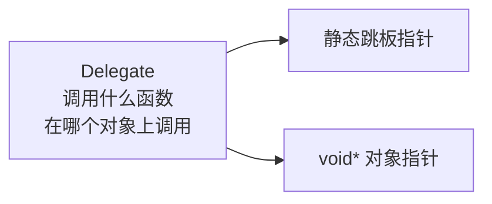
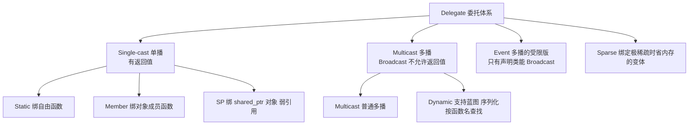

# Extra · Delegate 委托模式完全指南

> 目标：[全景篇](事件系统架构全景-七种模式对比.md) 把 Delegate 列为模式 ③（Unreal Engine 风格）。
> 这篇讲透：委托到底是什么、和 `std::function` / Signal/Slot 的精确边界、
> 一个零堆分配的 `MiniDelegate` 自研实现、Unreal 的完整分级体系（官方文档依据），
> 以及"为什么 Unreal 需要 Dynamic Delegate 这种慢东西"。
> 练习全部附参考答案。

---

## 1. 委托是什么：把「函数 + 对象」打包成一个值

成员函数不能单独存在——`&ACharacter::OnDeath` 必须绑上对象才能调用。**委托就是把这两样打包成一个可以存储、传递、拷贝的轻量对象：**



你其实天天在写"人肉委托"：

```cpp
// GLFWManager 里的 keyCallback 就是委托的雏形：
static void keyCallback(GLFWwindow* w, int key, int, int action, int) {
    auto* self = static_cast<GLFWManager*>(glfwGetWindowUserPointer(w));  // 对象
    if (action == GLFW_PRESS) self->onKeyPress(key);                     // 函数
}
```

GLFW 的 `userdata + static 函数` 就是 `[void* + 函数指针]`——一个 C 风格委托。委托模式做的事，就是把这个惯用法**类型安全化、产品化**。

---

## 2. 和 std::function / Signal 的精确边界

| | `std::function` | Delegate（单播） | Signal/Slot（模式②） |
|---|---|---|---|
| 能装什么 | 任何可调用对象 | 函数指针、成员函数+对象（**不支持捕获 lambda**） | 任何可调用对象 |
| 存储开销 | 类型擦除 + 可能堆分配 | **两个指针，恒定大小，永不分配** | 槽列表（分配） |
| 订阅者数量 | 1 | 1（单播）/ N（多播变体） | N（天职就是多播） |
| 内联可能性 | 低（虚表调用） | **高**（编译期已知的跳板） | 低 |
| 精确断开 | ❌ | ✅（按对象指针 `RemoveAll`） | ✅（句柄/track） |

> 💡 一句话分工：**要"任何 lambda 都能塞"用 `std::function`；要"一个函数槽 + 极致性能 + 能断开"用 Delegate；要"一对多广播"用 Signal/Slot 或多播 Delegate。**
> 多播 Delegate 和 Signal/Slot 在能力上几乎等价（模式③本质是模式②的特例），差异在 API 风格和生命周期模型（§5）。

---

## 3. MiniDelegate：零堆分配的自研实现（C++17）

核心技巧：**把成员函数指针放进模板参数**（编译期已知），运行时只存 `void*` 对象 + 一个静态"跳板"函数指针。这就是经典的 *Impossibly Fast C++ Delegates* 思路，EnTT 的 `delegate`、Unreal 的 C++ 委托都是这个路数。

📦 `src/mini_delegate.hpp`：

```cpp
#pragma once
// mini_delegate.hpp —— 零堆分配的委托（C++17）
#include <cstddef>
#include <vector>

namespace mini {

template <typename T> class Delegate;              // 主模板：只声明

template <typename R, typename... Args>            // 偏特化：吃函数签名
class Delegate<R(Args...)> {
public:
    // 绑定成员函数：bind<&Foo::bar>(&foo)
    template <typename C, R (C::*Method)(Args...)>
    void bind(C* object) {
        m_object = object;
        m_stub   = &methodStub<C, Method>;
    }

    // 绑定自由函数 / 静态成员函数：bind<&freeFn>()
    template <R (*Fn)(Args...)>
    void bind() {
        m_object = nullptr;
        m_stub   = &functionStub<Fn>;
    }

    // 调用。空委托调用是 UB（和 Unreal 的 Execute 相同约定）。
    R execute(Args... args) const { return m_stub(m_object, args...); }

    void  reset()            { m_object = nullptr; m_stub = nullptr; }
    explicit operator bool() const { return m_stub != nullptr; }
    bool  boundTo(const void* obj) const { return m_object == obj; }  // 给 RemoveAll 用

private:
    template <typename C, R (C::*Method)(Args...)>
    static R methodStub(void* obj, Args... args) {
        return (static_cast<C*>(obj)->*Method)(args...);
    }
    template <R (*Fn)(Args...)>
    static R functionStub(void*, Args... args) { return Fn(args...); }

    using Stub = R (*)(void*, Args...);   // 统一的跳板签名
    void* m_object = nullptr;
    Stub  m_stub   = nullptr;             // 大小恒为 2 个指针，永不分配
};

// ── 多播版：一列单播委托，广播时逐个 Execute（返回值丢弃）──────
template <typename T> class MulticastDelegate;

template <typename R, typename... Args>
class MulticastDelegate<R(Args...)> {
public:
    template <typename C, R (C::*Method)(Args...)>
    void add(C* object) {
        Delegate<R(Args...)> d;
        d.template bind<C, Method>(object);
        m_delegates.push_back(d);
    }

    template <R (*Fn)(Args...)>
    void add() {
        Delegate<R(Args...)> d;
        d.template bind<Fn>();
        m_delegates.push_back(d);
    }

    // 按对象断开全部绑定（等价 Unreal 的 RemoveAll）
    void removeAll(const void* object) {
        m_delegates.erase(
            std::remove_if(m_delegates.begin(), m_delegates.end(),
                           [object](const Delegate<R(Args...)>& d) {
                               return d.boundTo(object);
                           }),
            m_delegates.end());
    }

    void broadcast(Args... args) const {
        for (const auto& d : m_delegates) d.execute(args...);  // 顺序不保证有意义
    }

    std::size_t size() const { return m_delegates.size(); }

private:
    std::vector<Delegate<R(Args...)>> m_delegates;
};

}  // namespace mini
```

用起来：

```cpp
struct Achievement {
    void onPlayerDied(int playerId) { /* ... */ }
    void onPlayerDied2(int playerId) { /* ... */ }
};

Achievement ac;
mini::MulticastDelegate<void(int)> onPlayerDied;

onPlayerDied.add<Achievement, &Achievement::onPlayerDied>(&ac);
onPlayerDied.add<Achievement, &Achievement::onPlayerDied2>(&ac);
onPlayerDied.broadcast(7);

onPlayerDied.removeAll(&ac);   // 对象析构前退订，精确、O(N)
```

### 3.1 为什么它快

| `std::function` 装成员函数 | `Delegate` 装成员函数 |
|---|---|
| lambda 捕获对象指针 → 类型擦除进堆/SBO → 虚表 `invoke` | `void*` + 跳板指针，**两个机器字** |
| 调用：间接跳虚表 + 再跳目标 | 调用：一次间接跳转，且跳板可被内联后 **完全展开成直接调用** |
| 拷贝可能堆分配 | 拷贝 = 拷 16 字节 |

代价也很明确：**编译期必须知道绑哪个函数**（`bind<&Foo::bar>` 是模板参数），捕获 lambda 一律不支持——需要运行期灵活性的场合，还是 `std::function` / Signal。

### 3.2 空委托调用

`execute()` 对空委托是 UB（和 Unreal 的 `Execute()` 同一约定）。防御式写法：

```cpp
if (onDeath) onDeath.execute(entityId);   // operator bool 检查
```

Unreal 另提供 `IsBound()` / `ExecuteIfBound()` 做同样的事。

---

## 4. Unreal 的委托分级体系（官方文档依据）

Unreal 把委托做成了一个完整的类型系统（[官方文档](https://dev.epicgames.com/documentation/en-us/unreal-engine/multicast-delegates-in-unreal-engine)）：



多播绑定 API 一览（语义上每一种都对应一种生命周期策略）：

| 绑定函数 | 绑什么 | 对象死了会怎样 |
|---|---|---|
| `AddStatic()` | 全局函数 | —— |
| `AddRaw()` | 裸指针成员函数 | ⚠️ **悬垂，Broadcast 崩溃**（文档原话：may be unsafe） |
| `AddLambda()` | 无捕获 lambda | —— |
| `AddSP()` / `AddSPLambda()` | `shared_ptr` 对象 | **弱引用，自动跳过** |
| `AddUObject()` | `UObject` 成员函数 | **弱引用（GC 体系），自动跳过** |
| `Remove()` / `RemoveAll(obj)` | 精确退订 | 注意：`Remove` 后顺序不保证保持 |

关键语义（官方明确）：

- **多播不允许返回值**——N 个槽的返回值无法定义聚合语义；
- **`Broadcast()` 的调用顺序未定义**，不能依赖 Add 的顺序；
- `Broadcast()` 在零绑定时永远安全（空广播不报错）。

> 💡 对照自研版：`MulticastDelegate` 目前是"裸指针 + 手动 removeAll"档位（= `AddRaw`）。
> 练习 3 带你升级成弱引用安全版（= `AddUObject` 档）。

---

## 5. Dynamic Delegate：为什么引擎需要一个"慢"版本

普通委托把函数地址写死在模板参数里——**快，但只有编译期认识它的代码能用**。可引擎的编辑器、蓝图、存档系统在运行期只拿得到**字符串**（"对象 Foo 的 OnDeath 方法"）。Dynamic Delegate 就是为它们准备的：

| | 普通（Static）委托 | Dynamic 委托 |
|---|---|---|
| 绑定方式 | 编译期函数地址（模板） | 运行期**函数名字符串查找** |
| 性能 | 直接调用 | 慢一个量级（名字解析 + 跳转表） |
| 蓝图/编辑器可绑 | ❌ | ✅（`AddDynamic`） |
| 序列化/网络 | ❌ | ✅（函数名可存档可传输） |

这就是"模式③在 Unreal 里活得很好"的真正原因：**它不只是个回调，而是接入了引擎的反射/GC/蓝图生态**。你不用 Unreal 时，这一层的对应物是"消息总线 + 字符串 channel"（模式⑤）——同样是拿性能换运行期灵活性。

---

## 6. 生命周期：委托最危险的一平方公里

委托持有对象指针，所以「**对象先死、委托后执行**」是本模式唯一的死亡方式。三档防御：

1. **约定档**（`AddRaw`/自研裸指针版）：订阅者析构前必须 `RemoveAll(this)`。简单，但靠纪律——忘了就是悬垂。
2. **弱引用档**（`AddUObject`/`AddSP`）：委托持 `weak_ptr`，`broadcast` 时 `lock()` 失败就跳过。忘退订不崩，只是泄漏一条死连接，直到下次广播被清。
3. **RAII 档**：连接对象做成员（`ScopedConnection` 思路，见 [Signal/Slot 指南 §6](Signal-Slot信号槽完全指南.md)），析构自动退订。

> ⚠️ 引擎实践：帧循环里会广播的委托（每帧都触发的 onUpdate 类），一律用 2 或 3；
> 一次性委托（onLevelLoaded，触发后即弃）可以用 1，但要有"触发完自动清空"的纪律。

---

## 7. 何时用哪个：决策表

| 场景 | 选择 |
|---|---|
| GLFW 回调 → 成员函数（1 对 1，每帧热点） | `Delegate`（省 `std::function` 的分配） |
| 一对多广播 + 订阅者动态增删 | Signal/Slot（模式②）或多播 Delegate |
| 要捕获状态的 lambda 回调 | `std::function` / Signal |
| 蓝图/脚本/编辑器运行期绑定 | Dynamic Delegate（或消息总线） |
| 只是"把这次调用的函数参数化一下" | 模板参数 `template<typename F>` 直接传 |

---

## 8. 常见陷阱

1. **空委托直接 `execute`** → UB。用 `if (d) d.execute(...)`。
2. **`AddRaw` 档忘了 `RemoveAll`** → 对象析构后广播即崩。用弱引用档或 RAII 档。
3. **依赖 `Broadcast` 的调用顺序** → Unreal 官方明确顺序未定义；需要顺序就上 Signal/Slot 的分组（[Signal/Slot 指南 §7.2](Signal-Slot信号槽完全指南.md)）。
4. **想给多播委托加返回值** → 语义未定义（N 个返回值聚合谁说了算？）。要聚合用 Signal 的 combiner 或 `emitAccumulate`。
5. **用 Delegate 装捕获 lambda** → 装不进（模板参数必须是函数/成员函数指针）。改 `std::function`。

---

## 9. 速查表

| 你想做的事 | MiniDelegate 写法 | Unreal 对应 |
|---|---|---|
| 声明单播 | `mini::Delegate<void(int)> d;` | `DECLARE_DELEGATE_OneParam(D, int)` |
| 绑成员函数 | `d.bind<C, &C::m>(&obj);` | `BindUObject(&obj, &C::m)` |
| 绑自由函数 | `d.bind<&fn>();` | `BindStatic(&fn)` |
| 调用（空则跳过） | `if (d) d.execute(x);` | `ExecuteIfBound(x)` |
| 声明多播 | `mini::MulticastDelegate<void(int)> m;` | `DECLARE_MULTICAST_DELEGATE_OneParam(...)` |
| 添加订阅 | `m.add<C, &C::m>(&obj);` | `AddUObject(&obj, &C::m)` |
| 按对象全退订 | `m.removeAll(&obj);` | `RemoveAll(&obj)` |
| 广播 | `m.broadcast(x);` | `Broadcast(x)` |

---

## 🔧 练习

1. **改造 GLFWManager**：把 `ResizeCallback`（`std::function`）换成 `mini::Delegate<void(int,int)>`，对外提供 `setResizeCallback<C>(&obj)` 与 `setResizeCallback<&fn>()` 两个重载。说明这一改动省掉了什么开销。
2. **输出预测**（不许跑代码）：
   ```cpp
   mini::Delegate<void()> d;
   struct S { void a() { std::cout << "a"; } void b() { std::cout << "b"; } };
   S s;
   d.bind<S, &S::a>(&s);
   d.bind<S, &S::b>(&s);
   d.execute();
   ```
   输出什么？这体现了委托的什么语义？
3. **弱引用安全广播**：实现 `WeakMulticastDelegate<R(Args...)>`——槽持 `std::weak_ptr<C>` 而非裸指针，`broadcast` 自动跳过已过期对象。用「对象离开作用域后广播不崩溃」验证。
4. **概念题**：为什么 Unreal 多播委托禁止返回值，而单播允许？如果确实需要"所有订阅者的表决结果"（比如『任何一个系统消费了这个事件吗？』），该怎么设计？
5. **选型题**：同一引擎里四个场景，各选 Delegate / Signal/Slot / std::function / Dynamic Delegate 之一并说明理由：
   a) `RenderContext` 里每帧调用的 present 回调槽；
   b) "玩家死亡"通知（成就、UI、音效都关心）；
   c) 异步贴图加载完成时的回调（需要捕获贴图句柄和目标纹理槽）；
   d) 让关卡设计师在编辑器里给"踩到压力板"绑定任意蓝图函数。

---

## 📝 参考答案

### 1. 改造 GLFWManager

```cpp
// GLFWManager.h —— 关键改动
#include "mini_delegate.hpp"

class GLFWManager {
public:
    // 两个重载覆盖"成员函数"和"自由函数"
    template <typename C, void (C::*Method)(int, int)>
    void setResizeCallback(C* obj) { m_resizeCb.bind<C, Method>(obj); }

    template <void (*Fn)(int, int)>
    void setResizeCallback() { m_resizeCb.bind<Fn>(); }

private:
    mini::Delegate<void(int, int)> m_resizeCb;   // 取代 std::function

    static void framebufferResizeCallback(GLFWwindow* w, int width, int height) {
        auto* self = static_cast<GLFWManager*>(glfwGetWindowUserPointer(w));
        if (self && self->m_resizeCb)
            self->m_resizeCb.execute(width, height);   // 热路径：一次间接跳转
        glViewport(0, 0, width, height);
    }
};
```

省掉的开销：`std::function` 赋值 lambda 时的类型擦除（可能堆分配）、每次调用的虚表间接跳转。代价：业务方必须传编译期函数指针，不能再随手写 lambda——如果现有 `main.cpp` 依赖 lambda 注册，此改动是回归，需要评估（这正是 §7 决策表的"1 对 1 热点才值得"）。

### 2. 输出预测

输出 **`b`**。第二次 `bind` 直接覆盖了第一次的 `[对象, 跳板]` 两个指针——单播委托是**一个槽**，后绑覆盖先绑（和 `std::function` 的赋值语义一致）。要两个都执行需要 `MulticastDelegate::add`。另外注意：如果两次 `bind` 之间没有对象，`execute` 不会打印 "a"——它根本不在槽里了。

### 3. 弱引用安全广播

```cpp
template <typename T> class WeakMulticastDelegate;

template <typename R, typename... Args>
class WeakMulticastDelegate<R(Args...)> {
public:
    // 槽：跳板 + weak_ptr（对象必须由 shared_ptr 管理）
    template <typename C, R (C::*Method)(Args...)>
    void add(std::shared_ptr<C> object) {
        m_slots.push_back({ std::weak_ptr<void>(object),
                            &stub<C, Method> });
    }

    void broadcast(Args... args) const {
        for (const auto& s : m_slots)
            if (auto obj = s.object.lock())     // 过期 → 跳过，不崩
                s.stub(obj.get(), args...);
    }

private:
    template <typename C, R (C::*Method)(Args...)>
    static R stub(std::shared_ptr<void>& obj, Args... args) {
        return (static_cast<C*>(obj.get())->*Method)(args...);
    }
    using Stub = R (*)(std::shared_ptr<void>&, Args...);
    struct Slot { std::weak_ptr<void> object; Stub stub; };
    std::vector<Slot> m_slots;
};

// 验证
{
    auto achievement = std::make_shared<Achievement>();
    WeakMulticastDelegate<void(int)>::add...        // add<Achievement, &Achievement::onPlayerDied>(achievement)
    onDied.broadcast(1);                            // ✅ 正常触发
}                                                   // achievement 析构
onDied.broadcast(2);                                // ✅ 安全跳过，不崩溃
```

细节：`broadcast` 里 `lock()` 成功的那一份 `shared_ptr` 保证槽函数执行期间对象存活（和 Boost.Signals2 的 `track` 同一思路，见 [Signal/Slot 指南 §7.4](Signal-Slot信号槽完全指南.md)）。代价是对象必须 `shared_ptr` 管理，且死连接要等下次广播才被跳过（可选择在 `lock` 失败时顺手标记清理）。

### 4. 概念题

多播 N 个槽同时返回，聚合规则没有唯一答案（取第一个？最后一个？全部收集？任一为 true？）——**返回值语义无法定义，所以干脆禁止**。这是"API 不提供歧义能力"的设计。单播只有 1 个返回者，语义唯一，自然允许。

需要表决时，把"聚合规则"还给调用方——即 Signal 世界的 combiner：

```cpp
// 利用 AccumulateSignal（Signal/Slot 指南练习 3）：
AccumulateSignal<bool, int> keyQuery;       // "有人消费这个按键吗？"
auto votes = keyQuery.emitAccumulate(key);
bool consumed = std::any_of(votes.begin(), votes.end(), [](bool v){ return v; });
```

（Unreal 的对应物是 Event 时把 `handled` 布尔放进事件结构体传递——模式①的做法。）

### 5. 选型题

- **a) 每帧 present 回调槽 → `Delegate`**。1 对 1、每帧热点、无 lambda 需求——正是零分配委托的主场（本篇 §7 决策表第一行）。
- **b) 玩家死亡通知 → Signal/Slot（或多播 Delegate）**。典型一对多，订阅者动态增删（成就系统后期才挂）。两者皆可；若引擎已有 Signal 基建就不引入第二套。
- **c) 异步加载回调 → `std::function`**。回调需要捕获贴图句柄、目标槽位等状态——委托装不了捕获 lambda，这是 `std::function` 的合法场景（一次性、非热点）。
- **d) 编辑器绑蓝图函数 → Dynamic Delegate**。运行期按函数名绑定是它的定义性特征（§5）；普通委托编译期函数地址根本无法满足"设计师任意绑定"。

---

## 参考资料

- [Unreal 官方文档 — Multicast Delegates](https://dev.epicgames.com/documentation/en-us/unreal-engine/multicast-delegates-in-unreal-engine)（§4 表格与语义的原始出处）
- [EnTT Wiki — Delegate](https://github.com/skypjack/entt/wiki/Events,-Signals-and-Everything-in-Between)（同思路的另一个工业实现：`connect<&f>` 模板绑定、payload、runtime 连接）
- [The Impossibly Fast C++ Delegates](https://www.codeproject.com/Articles/11015/The-Impossibly-Fast-C-Delegates)（`void*` + 静态跳板技巧的原典）
- [Signal/Slot 信号槽完全指南](Signal-Slot信号槽完全指南.md)（模式②：多播、track、combiner）
- [Game Programming Patterns — Observer](https://gameprogrammingpatterns.com/observer.html)（委托背后的模式本体）

---

> 下一篇 Extra（事件系统模式专题）👉 [事件队列 EventQueue 完全指南](事件队列EventQueue完全指南.md)（模式 ④）
