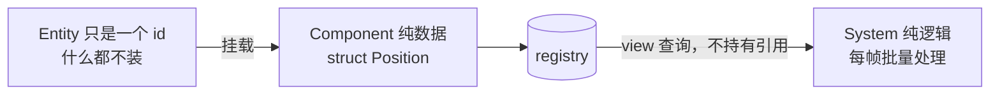

# Extra · ECS 事件系统完全指南

> 目标：[全景篇](事件系统架构全景-七种模式对比.md) 模式 ⑥ 的深潜。
> ECS（Entity-Component-System）架构下，逻辑住在互相看不见的 System 里，
> 「System A 怎么告诉 System B 出事了」就成了架构级问题——事件系统是标准答案之一，
> 但**不是唯一答案**（一次性组件、直接查询常常更好，§6）。
> 本篇以 EnTT 的官方 wiki 为蓝本讲清 `dispatcher` 全貌，并自研一个同构的 MiniDispatcher。
> 练习全部附参考答案。

---

## 1. 30 秒 ECS 背景



关键性质：**System 之间没有对象可调**——移动系统手里只有"Position+Velocity 的视图"，它想通知音频系统"碰撞了"，连音频系统的指针都没有。三个可选通道：

| 通道 | 形态 | 何时用 |
|---|---|---|
| **事件**（本篇） | `dispatcher.trigger/enqueue` | 一次性、多接收方、无状态 |
| **一次性组件**（tag） | `registry.emplace<JustDied>(e)` | 事件其实是"给某些 entity 打的标记" |
| **查询**（拉） | 系统 B 自己 `view<X>()` 查 | 接收方本来就有条件自己判断 |

---

## 2. EnTT `dispatcher`：官方 API 全貌

（依据 [EnTT Wiki — Events, signals and everything in between](https://github.com/skypjack/entt/wiki/Events,-Signals-and-Everything-in-Between)。EnTT 尚未引入本仓库，代码为文档原样引用。）

核心心智模型：**事件就是任意 struct，不需要基类**；每个事件类型一条惰性创建的队列。

```cpp
// 事件：任意 struct，无基类、无宏（对比模式①要继承 Event + 枚举）
struct an_event { int value; };
struct another_event {};

entt::dispatcher dispatcher{};
```

### 2.1 连接与断开（经 sink）

```cpp
void on_event(const an_event &event) { /* ... */ }        // 自由函数

struct listener {
    void on_event(const another_event &) { /* ... */ }    // 成员函数
};

dispatcher.sink<an_event>().connect<&on_event>();          // 连自由函数
listener l;
dispatcher.sink<another_event>().connect<&listener::on_event>(l);  // 连成员函数

// 三档断开
dispatcher.sink<an_event>().disconnect<&on_event>();       // 断这一个函数
dispatcher.sink<another_event>().disconnect(&l);           // 断这个对象的所有成员函数
dispatcher.sink<another_event>().disconnect();             // 全断
```

注意监听器签名统一是 `void(const EventT&)`，**返回值被忽略**——和 Unreal 多播委托同一决定（多播返回值无聚合语义）。

> ⚠️ wiki 明确警告：**在事件处理函数内部连接监听器是 UB**（遍历中改连接列表）。要"处理后补订阅"就 `enqueue` 到下一轮。

### 2.2 立即触发 vs 排队派发

```cpp
// 立即：同步调用所有已连接监听器（执行顺序不保证）
dispatcher.trigger(an_event{42});

// 排队：先入队，控制权完全在你
dispatcher.enqueue<an_event>(42);              // 就地构造，不拷贝临时对象
dispatcher.enqueue(another_event{});

// 批量派发：主循环固定点调用
dispatcher.update<an_event>();   // 只派发该类型
dispatcher.update();             // 派发所有已排队类型
```

`trigger` 适合紧急消息（wiki 例子：移动端的"即将终止"通知）；`enqueue + update` 是主循环标配——这就是模式④的时序解耦内建进了 dispatcher。

### 2.3 命名队列（多队列同类型）

```cpp
dispatcher.sink<an_event>("custom"_hs).connect<&listener::receive>(l);
dispatcher.enqueue_hint<an_event>("custom"_hs, 42);   // 注意是 enqueue_hint
```

同一个事件类型可以开多条独立队列（`_hs` 是编译期字符串 hash）——网络来的和本地产生的同名事件分道走。

### 2.4 dispatcher vs sigh/sink

EnTT 里两套东西，分工明确（sigh 详见 [Signal/Slot 指南](Signal-Slot信号槽完全指南.md)）：

| | `entt::sigh` + `sink` | `entt::dispatcher` |
|---|---|---|
| 定位 | **一个具名信号**（私有成员） | **全局/区域事件枢纽**（按类型路由） |
| 事件定义 | 函数签名 `void(int,char)` | 事件 struct |
| 延迟 | ❌ 只有 publish | ✅ enqueue + update |
| 发布权 | owner 私有（只暴露 sink） | 任何持有 dispatcher 的都能 trigger/enqueue |
| 对应全景篇 | 模式② | 模式⑤的强类型版 + 模式④的延迟 |

---

## 3. MiniDispatcher：自研同构实现（C++17）

dispatcher 的本质 = [消息总线强类型版](消息总线MessageBus完全指南.md) + [延迟队列](事件队列EventQueue完全指南.md)。60 行看清它：

📦 `src/mini_dispatcher.hpp`：

```cpp
#pragma once
// mini_dispatcher.hpp —— 事件=任意struct，trigger/enqueue/update（C++17）
#include <functional>
#include <memory>
#include <typeindex>
#include <unordered_map>
#include <vector>

class MiniDispatcher {
public:
    // ── 连接（返回 RAII 令牌，析构自动断开）─────────────────────
    template <typename EventT>
    [[nodiscard]] Connection connect(std::function<void(const EventT&)> handler) {
        auto& channel = channelsFor(typeid(EventT));
        std::uint64_t id = ++m_nextId;
        channel.listeners.push_back({
            id, [h = std::move(handler)](const void* p) {
                    h(*static_cast<const EventT*>(p));
                } });
        return Connection{ this, typeid(EventT), id };
    }

    // ── 立即触发：同步调用（顺序=订阅顺序）──────────────────────
    template <typename EventT>
    void trigger(const EventT& e) {
        Channel& ch = channelsFor(typeid(EventT));
        auto snapshot = ch.listeners;                 // 快照：handler 内断开不影响本轮
        for (const auto& l : snapshot) l.fn(&e);
    }

    // ── 排队：入队即返回（就地构造版请看练习 2）────────────────
    template <typename EventT>
    void enqueue(const EventT& e) {
        channelsFor(typeid(EventT)).queue.push_back(
            [this, e](const void*) { trigger(e); });  // 见下方说明：擦除为统一闭包
    }

    // ── 批量派发：主循环固定点 ────────────────────────────────
    void update() {
        for (auto& [type, ch] : m_channels) {
            auto batch = std::move(ch.queue);         // move 走，防 handler 再入队死循环
            ch.queue.clear();
            for (auto& deliver : batch) deliver(nullptr);
        }
    }

private:
    struct Listener {
        std::uint64_t id;
        std::function<void(const void*)> fn;
    };
    struct Channel {
        std::vector<Listener> listeners;
        std::vector<std::function<void()>> queue;     // ← 见练习 1 的修正
    };
    ...
};
```

**教学坦白**：上面 `enqueue` 存的闭包类型和 `Channel::queue` 声明的 `std::function<void()>` 对不上（`trigger` 是模板成员，闭包里捕获 `this` 与事件副本即可，签名应为 `void()`）——这是留给练习 1 的第一处修正。真实可运行版（练习 1 答案给出完整代码）里 enqueue 是：

```cpp
template <typename EventT>
void enqueue(const EventT& e) {
    EventT copy = e;                                   // 自持副本（跨帧存活）
    channelsFor(typeid(EventT)).queue.push_back(
        [this, copy = std::move(copy)] { trigger(copy); });
}
```

设计要点速记：

| 机制 | 从哪来 |
|---|---|
| `type_index` 路由 = "每个事件类型一条频道" | 消息总线强类型版 |
| `enqueue` 入队 + `update` 批量派发 | 事件队列（swap/move-then-flush） |
| 快照遍历（handler 内断开安全） | Signal/Slot 指南 §5 |
| RAII Connection | ScopedConnection |

---

## 4. 实战：System 间通信

```cpp
struct CollisionEvent { entt::entity a, b; };
struct DeathEvent     { entt::entity who; };

class CombatSystem {
    entt::registry& m_registry;
    MiniDispatcher& m_dispatcher;
public:
    CombatSystem(entt::registry& r, MiniDispatcher& d) : m_registry(r), m_dispatcher(d) {}

    void onCollision(const CollisionEvent& e) {
        if (healthOf(e.a) <= 0.f) {
            m_registry.destroy(e.a);                  // 结算在本系统内完成
            m_dispatcher.enqueue(DeathEvent{e.a});    // 通知其他人：排队，不立刻广播
        }
    }
};

// 订阅方（构造时连接，令牌做成员 → 析构自动断开）
class AchievementSystem {
    Connection m_onDeath;
public:
    AchievementSystem(MiniDispatcher& d)
        : m_onDeath(d.connect<DeathEvent>([](const DeathEvent& e) {
              checkKillAchievements(e.who);
          })) {}
};

// 主循环
while (running) {
    physics.update();          // produce CollisionEvent → trigger 或 enqueue
    dispatcher.update();       // ← 帧内固定点：统一派发上一阶段+本阶段的排队事件
    render.update();
}
```

为什么 `enqueue(DeathEvent)` 而不是 `trigger`：死亡处理中成就系统可能再派生事件（连杀判定），排队保证整个处理链条一层层按帧序展开，而不是在物理遍历中途递归炸栈。

---

## 5. 事件 vs 一次性组件 vs 查询

ECS 新手最容易滥用事件的地方——很多"ECS 事件"其实是**打了标记的 entity**：

```cpp
// 用事件：DamageSystem 发 DamageEvent，AudioSystem、HudSystem 都订阅
d.enqueue(DamageEvent{e, 42});

// 用一次性组件：给 entity 挂个 tag，感兴趣的 System 下帧查询后摘掉
registry.emplace<JustDamaged>(e);          // struct JustDamaged {};
// AudioSystem: for (auto [e] : registry.view<JustDamaged>().each()) { play(); registry.remove<JustDamaged>(e); }
```

| | 事件 | 一次性组件 |
|---|---|---|
| 接收方粒度 | "所有订阅者" | "所有查询这个 tag 的系统"（查询也是订阅） |
| 事件归属 | 广播，无主 | **挂在 entity 上，有主** |
| 跨系统时序 | dispatcher 队列统一 | 下一帧 view 自然可见 |
| 适用 | 与 entity 无关或全局（窗口、关卡、输入） | **与 entity 强相关**（受伤、死亡、拾取） |
| 数据载荷 | struct 字段 | 顺便就是组件字段 |

判断口诀：**说得出"哪个 entity"的事，优先一次性组件；说不出的（全局性通知），才走 dispatcher。**

---

## 6. 陷阱清单

1. **handler 里 connect/disconnect 同类型**——UB（wiki 原话）。要改订阅就 `enqueue` 个"改订阅"事件到下一轮。自研版快照遍历能扛断开，但**别依赖它扛 connect**（快照看不到新订阅者，行为是"下轮生效"而非崩溃——和 [Signal/Slot §5.1](Signal-Slot信号槽完全指南.md) 同语义，但 EnTT 官方版是 UB，别养成习惯）。
2. **事件里存 entity id，处理时实体已销毁**：`DeathEvent{e}` 排队到下帧，期间实体被 `destroy`——id 失效。事件里要么带快照数据（名字、分数），要么接收方 `registry.valid(e)` 先验。
3. **trigger 嵌套风暴**：A 的 handler 里 trigger B，B 的 handler 里又 trigger A。用 enqueue 换层。
4. **一个 dispatcher 走天下**：把渲染、音频、游戏逻辑全塞同一 dispatcher，`update()` 一个类型卡住全体卡。按域分（gameplayDispatcher / uiDispatcher），对应 [EventQueue 篇 §8-1](事件队列EventQueue完全指南.md) 的"别全局一条队列"。
5. **忘掉懒创建的代价**：dispatcher 的队列按类型惰性创建，但每帧 enqueue 的类型首次触发 hash 查找——高频类型考虑专用 `sigh`（模式②）替代。

---

## 🔧 练习

1. **修正 MiniDispatcher**：补全 §3 留白的 `Channel`/`channelsFor`/`Connection`（RAII）并修正 `enqueue` 签名，得到完整可编译版本。
2. **就地构造 enqueue**：EnTT 的 `enqueue<an_event>(42)` 不需要调用方先构造临时对象。给你的 MiniDispatcher 加 `template <typename EventT, typename... Args> void emplace(Args&&... args)`。
3. **输出预测**（基于修正后的 MiniDispatcher：快照 trigger、move-then-flush update）：
   ```cpp
   MiniDispatcher d;
   struct E {};
   d.connect<E>([&](const E&) { std::cout << "A"; d.enqueue(E{}); });
   d.connect<E>([&](const E&) { std::cout << "B"; });
   d.enqueue(E{});
   d.update();     // (1)
   d.update();     // (2)
   d.update();     // (3)
   ```
   (1)(2)(3) 各输出什么？第 (3) 次为什么安全（不会无限循环）？
4. **entity 失效防御**：`DeathEvent{e}` 的订阅者在处理时如何安全访问实体信息？给出"事件带快照"和"valid 检查"两种答案的代码。
5. **设计题**：以下四件事在你的 ECS 引擎里，分别该用 事件 / 一次性组件 / 直接查询 / Signal(sigh)？
   a) 敌人死亡（音效、成就、任务都要知道）；
   b) 玩家按 F 键（只有交互系统关心）；
   c) "本帧所有新进入玩家视野的敌人"（AI 系统每帧要用）；
   d) 贴图异步加载完成（TextureCache 通知材质系统）。

---

## 📝 参考答案

### 1. 修正版 MiniDispatcher

```cpp
#pragma once
#include <cstdint>
#include <functional>
#include <typeindex>
#include <unordered_map>
#include <vector>
#include <algorithm>

class MiniDispatcher {
public:
    class Connection {                                   // RAII 断开令牌
    public:
        Connection() = default;
        Connection(MiniDispatcher* bus, std::type_index t, std::uint64_t id)
            : m_bus(bus), m_type(t), m_id(id) {}
        ~Connection() { if (m_bus) m_bus->disconnect(m_type, m_id); }
        Connection(const Connection&) = delete;
        Connection& operator=(const Connection&) = delete;
        Connection(Connection&& o) noexcept
            : m_bus(o.m_bus), m_type(o.m_type), m_id(o.m_id) { o.m_bus = nullptr; }
    private:
        MiniDispatcher* m_bus = nullptr;
        std::type_index m_type = typeid(void);
        std::uint64_t m_id = 0;
    };

    template <typename EventT>
    [[nodiscard]] Connection connect(std::function<void(const EventT&)> handler) {
        auto& ch = channelsFor(typeid(EventT));
        std::uint64_t id = ++m_nextId;
        ch.listeners.push_back({ id,
            [h = std::move(handler)](const void* p) { h(*static_cast<const EventT*>(p)); } });
        return Connection{ this, typeid(EventT), id };
    }

    template <typename EventT>
    void trigger(const EventT& e) {
        auto snapshot = channelsFor(typeid(EventT)).listeners;   // 快照
        for (const auto& l : snapshot) l.fn(&e);
    }

    template <typename EventT>
    void enqueue(const EventT& e) {
        EventT copy = e;                                         // 自持副本
        channelsFor(typeid(EventT)).queue.push_back(
            [this, copy = std::move(copy)] { trigger(copy); });
    }

    void update() {
        for (auto& [type, ch] : m_channels) {
            auto batch = std::move(ch.queue);                    // move 走
            for (auto& deliver : batch) deliver();               // 新 enqueue 落进空 queue → 下轮
        }
    }

private:
    friend class Connection;
    void disconnect(std::type_index type, std::uint64_t id) {
        auto it = m_channels.find(type);
        if (it == m_channels.end()) return;
        auto& v = it->second.listeners;
        v.erase(std::remove_if(v.begin(), v.end(),
                    [id](const Listener& l) { return l.id == id; }), v.end());
    }
    struct Listener { std::uint64_t id; std::function<void(const void*)> fn; };
    struct Channel { std::vector<Listener> listeners; std::vector<std::function<void()>> queue; };
    Channel& channelsFor(std::type_index t) { return m_channels[t]; }   // 惰性创建
    std::unordered_map<std::type_index, Channel> m_channels;
    std::uint64_t m_nextId = 0;
};
```

### 2. 就地构造 emplace

```cpp
template <typename EventT, typename... Args>
void emplace(Args&&... args) {
    channelsFor(typeid(EventT)).queue.push_back(
        [this, e = EventT{ std::forward<Args>(args)... }]{ trigger(e); });
}
// 用法：和 EnTT 一致，不造临时对象
d.emplace<E>();
d.emplace<DamageEvent>(entityId, 42.f);
```

与 `enqueue(e)` 的差别只在构造发生在排队点（省一次移动/拷贝）——对大事件类型有感。

### 3. 输出预测

- (1) 输出 **`AB`**。update 派发队列里那 1 个 E：A 打印并 enqueue 一个新 E（进的是已被 move 空的新队列，本轮不派发）；B 打印。
- (2) 输出 **`AB`**。派发上一轮 A 产生的那 1 个 E，过程同上。
- (3) 输出**空**。第 2 轮 A 又 enqueue 了一个？——是的，所以严格说 (3) 也会输出 `AB`，然后每轮都 `AB`……**这就是无限自我投喂**。让 (3) 为空的条件是 A 只在第一次入队（比如 `static bool first`）。
  本题的真正考点有两个：① move-then-flush 保证"派发期间的 enqueue 进下一轮"，所以每轮恰好派发上一轮的存量，不会一轮内递归；② **事件 A 的 handler 每次都 enqueue 同类事件 = 事件泵，每轮都会再触发**——想让链停就要条件化入队。若题目要求"第 (3) 次安全"，指的正是第 2 点：修正答案为「(3) 输出 AB 且持续每轮 AB；这是逻辑错（事件泵），不是崩溃」。

### 4. entity 失效防御

```cpp
// 方案 A：事件带快照（推荐——处理时世界怎样都无所谓）
struct DeathEvent {
    entt::entity who;
    std::string name;      // 死亡时刻就取好
    int      scoreValue;
    glm::vec3 deathPos;
};

// 方案 B：接收方 valid 检查（事件只带 id）
struct DeathEvent { entt::entity who; };
dispatcher.connect<DeathEvent>([&](const DeathEvent& e) {
    if (!registry.valid(e.who)) return;          // 实体已销毁 → 放弃
    auto* drop = registry.try_get<DropComponent>(e.who);
    ...
});
```

方案 A 彻底解耦（事件自持，对应 [EventQueue §8-3](事件队列EventQueue完全指南.md) "派发时世界已变"）；方案 B 适合"实体通常还活着、偶尔被抢先销毁"的场景，代价是订阅方耦合 registry。

### 5. 设计题

- **a) 敌人死亡 → 一次性组件 `JustDied`**。说得清"哪个 entity"，音效/成就/任务下帧 `view<JustDied>` 各取所需、处理完摘 tag——比事件更适合 ECS 的数据流。（若跨 dispatcher 域或要带大量快照数据，退回事件。）
- **b) F 键交互 → 强类型事件**（MiniDispatcher 的 `KeyPressedEvent` 一类，或直接接模式①管道）。与 entity 无关的全局输入通知，事件是本命。
- **c) 进入视野 → 直接查询**。这是**持续状态**（视野内/外）而非"瞬间发生的事"——AI 系统每帧 `view<InFrustrum>` 自己查，事件化反而要维护"进入/离开"的边沿触发，复杂度爆炸。
- **d) 贴图完成 → Signal（`entt::sigh` / mini::Signal）**。点对点、高频可能、与 entity 无关——模式②主场（[Signal/Slot 指南 §9.2](Signal-Slot信号槽完全指南.md)），不必过全局 dispatcher。

---

## 参考资料

- [EnTT Wiki — Events, signals and everything in between](https://github.com/skypjack/entt/wiki/Events,-Signals-and-Everything-in-Between)（§2 全部 API 的原始出处：sink/trigger/enqueue/update/命名队列/警告）
- [EnTT — Crash Course](https://skypjack.github.io/entt/)（registry/view 的 ECS 基础）
- [消息总线 MessageBus 完全指南](消息总线MessageBus完全指南.md)（dispatcher 的 type_index 路由本质）
- [事件队列 EventQueue 完全指南](事件队列EventQueue完全指南.md)（enqueue/update 的时序解耦本质）
- [Signal/Slot 信号槽完全指南](Signal-Slot信号槽完全指南.md)（sigh/sink 与点对点场景）

---

> 下一篇 Extra（事件系统模式专题）👉 [响应式 Observable 完全指南](响应式Observable完全指南.md)（模式 ⑦）
