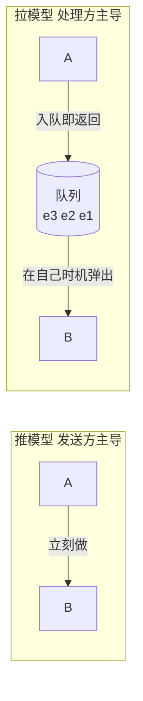
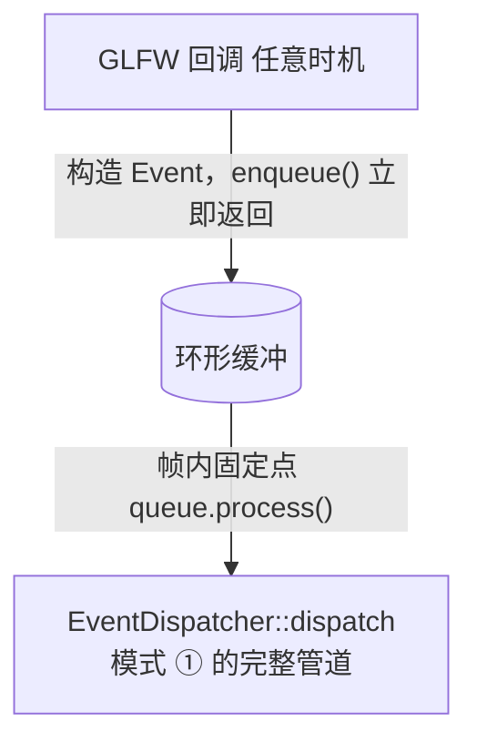

# Extra · 事件队列 EventQueue 完全指南

> 目标：[全景篇](事件系统架构全景-七种模式对比.md) 模式 ④ 的深潜。
> 前三种模式（①②③）派发都是**立即的**——`publish` 不执行完所有 handler 不返回。
> 事件队列把「**什么时候发送**」和「**什么时候处理**」拆开，这是它独有的、
> 也是其他模式替代不了的能力（[Game Programming Patterns — Event Queue](https://gameprogrammingpatterns.com/event-queue.html)）。
> 练习全部附参考答案。

---

## 1. 为什么需要"延迟"：三个真实死法

GPP 章节用音频引擎讲了三个问题，每一个都能在你的引擎里复发：

| # | 问题 | 你的引擎里的样子 |
|---|------|-----------------|
| 1 | **同步调用阻塞调用者** | 游戏线程里 `playSound()` 要先解码音频文件——主循环当场卡住几帧 |
| 2 | **请求无法聚合处理** | 一帧里 20 个敌人同时死亡，20 声"惨叫"叠加 = 一声两倍响的爆音；想聚合去重，但每个 `playSound` 都是独立即时调用，谁也看不见全貌 |
| 3 | **在错误的线程上执行** | 音频回调线程 / 网络线程里直接触发 UI 更新——跨线程改状态，数据竞争 |

**共同根源：调用方说"现在就做"，而处理方需要"我方便的时候做"。** 推(push)与拉(pull)的节奏冲突，队列就是中间的缓冲。



> 模式①②③ 都是推模型；事件队列 = 推进来的请求 + 拉出去的处理。

> 💡 GPP 原文的判断标准：**只想解耦"谁收消息"→ 用 Observer（模式①②）就够了；要解耦"什么时候处理"→ 才需要队列。** 队列复杂度高得多，别乱上。

---

## 2. v1：环形缓冲 + Event 基类（与模式 ① 组合）

最经典的形态：定长数组当环形缓冲，先进先出。事件用进阶 01 的 `Event` 继承体系，处理时交给 `EventDispatcher`：

📦 `src/event_queue.hpp`：

```cpp
#pragma once
// event_queue.hpp —— 定长环形事件队列（C++17），配模式①的事件体系
#include <memory>
#include <vector>
#include "Event.h"            // 进阶 01 的 Event 基类
#include "EventDispatcher.h"  // 进阶 01 的 EventDispatcher

class EventQueue {
public:
    explicit EventQueue(std::size_t capacity = 256)
        : m_buffer(capacity) {}

    // ── 阶段 1：收集（任何地方、任何时候调用，立即返回）─────────
    void enqueue(std::unique_ptr<Event> e) {
        std::size_t next = (m_head + 1) % m_buffer.size();
        if (next == m_tail) {
            onOverflow();                      // 满了：见 §6 的策略讨论
            return;                            // 丢弃本条（最简单的策略）
        }
        m_buffer[m_head] = std::move(e);
        m_head = next;
    }

    // ── 阶段 2：处理（主循环的固定时机调用）───────────────────
    void process() {
        while (m_tail != m_head) {             // 把本轮积压全部派发
            Event& e = *m_buffer[m_tail];
            m_tail = (m_tail + 1) % m_buffer.size();
            if (m_callback) m_callback(e);     // 通常是：EventDispatcher::dispatch
        }
    }

    void setHandler(std::function<void(Event&)> cb) { m_callback = std::move(cb); }
    std::size_t pending() const { return (m_head - m_tail + m_buffer.size()) % m_buffer.size(); }
    bool empty() const { return m_head == m_tail; }

protected:
    virtual void onOverflow() {}               // 子类覆盖成打日志/扩容/覆盖最旧

private:
    std::vector<std::unique_ptr<Event>> m_buffer;
    std::size_t m_head = 0;                    // 写位置
    std::size_t m_tail = 0;                    // 读位置
    std::function<void(Event&)> m_callback;
};
```

### 2.1 接进你的引擎



```cpp
// main.cpp —— 关键改动只有两处
window.setEventCallback([&queue](Event& e) { queue.enqueue(e.clone()); });  // 收集
while (!window.shouldClose()) {
    queue.process();        // ← 处理时机统一：帧首
    window.pollEvents();
    /* update / render */
}
```

**收益**：物理系统正在遍历实体时，用户点了"删除实体"按钮——点击事件躺在队列里，等本帧物理结算完、下一帧 `process()` 才真正删除。时序炸弹拆除。

> ⚠️ 前提：`enqueue` 的事件必须**自持数据**（`clone()`/值拷贝），不能存指向栈上对象的指针——入队时刻和派发时刻之间，那个对象可能已经没了（§8 陷阱 2）。

---

## 3. v2：类型擦除的任务队列（最实用的通用形态）

如果不需要 Event 继承体系，把"事件"退化成"待执行的闭包"——一个 `vector<function<void()>>` 就是最短可用实现，音频请求、延迟初始化、主线程代理任务全都适用：

```cpp
class TaskQueue {
public:
    void post(std::function<void()> task) {          // 任何线程语义上"投递"
        m_tasks.push_back(std::move(task));
    }
    void flush() {                                   // 主线程固定时机执行
        std::vector<std::function<void()>> swap;
        swap.swap(m_tasks);                          // 关键：先swap再执行
        for (auto& t : swap) t();                    // 执行中 post 的新任务进下轮
    }
private:
    std::vector<std::function<void()>> m_tasks;
};

// 用法：音频线程解码完成，把"上传纹理"这个活儿扔回主线程
taskQueue.post([handle = tex.handle, pixels = std::move(data)]() mutable {
    uploadTexture(handle, *pixels);   // 在主线程安全执行（GL 上下文要求）
});
```

两个要点：**swap-then-flush**（执行期间新入队任务不会迭代器失效，留到下一轮）；**闭包按值捕获数据**（跨线程/跨帧的自持性）。

---

## 4. 带时间的延迟：不只"下一帧"，而是"N 毫秒后"

技能冷却、按键连发、过场编排都需要定时事件。最小堆按触发时间排序，每帧检查到点的事件：

```cpp
struct TimedEvent {
    float triggerTime;                     // 绝对时间（秒）
    std::function<void()> action;
};

class DelayedQueue {
public:
    void schedule(float delaySeconds, std::function<void()> action) {
        m_heap.push_back({ m_now + delaySeconds, std::move(action) });
        std::push_heap(m_heap.begin(), m_heap.end(), byTimeDesc);
    }
    void update(float now) {               // 主循环每帧调用
        m_now = now;
        while (!m_heap.empty() && top().triggerTime <= now) {
            std::pop_heap(m_heap.begin(), m_heap.end(), byTimeDesc);
            auto e = std::move(m_heap.back()); m_heap.pop_back();
            e.action();                    // 到点执行
        }
    }
private:
    static bool byTimeDesc(const TimedEvent& a, const TimedEvent& b) {
        return a.triggerTime > b.triggerTime;      // min-heap：早的先出
    }
    const TimedEvent& top() const { return m_heap.front(); }
    float m_now = 0.f;
    std::vector<TimedEvent> m_heap;
};

// 连按 0.3 秒后自动开火；冷却 2 秒的技能
delayed.schedule(0.3f, [&]{ player.startAutoFire(); });
```

> 💡 这就是 Unreal `SetTimer` / 各家引擎 scheduler 的内核。和 `sleep` 的本质区别：**不阻塞任何线程**，只是把 action 排进未来的某一帧。

---

## 5. 多生产者：音频线程 → 主循环

GPP 问题 3 的完整解法。v1/v2 都不是线程安全的；跨线程投递加一把小锁通常就够（投递频率远低于每帧渲染频率，锁竞争可忽略）：

```cpp
class ThreadSafeTaskQueue {
public:
    void post(std::function<void()> task) {
        {   std::lock_guard lock(m_mutex);
            m_tasks.push_back(std::move(task));
        }
    }
    void flush() {
        std::vector<std::function<void()>> swap;
        {   std::lock_guard lock(m_mutex);          // 只在交换瞬间持锁
            swap.swap(m_tasks);
        }
        for (auto& t : swap) t();                   // 执行在锁外——慢任务不堵生产者
    }
private:
    std::mutex m_mutex;
    std::vector<std::function<void()>> m_tasks;
};
```

生产级音频引擎会换成**无锁 SPSC 环形队列**（单生产者单消费者，原子下标，零锁零分配）——原理相同：写入端永远只是"放到数组里、推进写下标"，消费端在自己的时机批量拉走。初学阶段锁版本完全够用。

---

## 6. 队列满了怎么办：丢弃策略

定长环形队列一定会遇到溢出（GPP：游戏实体死亡风暴 × 队列 256）。可选策略：

| 策略 | 行为 | 适合 |
|---|---|---|
| **丢最新**（本篇 v1） | 新来的直接扔 | 保序重要、旧事件必须处理（输入序列） |
| **丢最旧**（覆盖） | 覆盖队头 | 最新状态重要（鼠标位置、手柄摇杆——只要最新值） |
| **扩容** | 动态 vector，永不丢 | 桌面引擎、不在乎尖峰分配 |
| **分优先级** | 高优队列先出 | 网络包、崩溃上报 |

> ⚠️ GPP 提醒的**队头阻塞**：一个慢事件卡住整个队列，后面全堵。解法是按类型分队列（输入/音频/网络各一条）或设优先级。

---

## 7. 录制与回放：队列的免费赠品

立即派发的事件转瞬即逝；进了队列的事件是**数据**，天然可以：

```cpp
void process() {
    while (m_tail != m_head) {
        Event& e = *m_buffer[m_tail];
        if (m_recording) m_tape.push_back(e.serialize());   // 录：序列化入带
        dispatch(e);
    }
}
void replay(const Tape& tape) {                              // 放：按序重投
    for (const auto& frame : tape) dispatch(deserialize(frame));
}
```

用途：bug 复现（用户发来录像带）、确定性回放（电竞反外挂）、自动化测试（回放事件流断言状态）。这是模式①②③都给不了的能力。

---

## 8. 陷阱清单

1. **全局中央队列 = 全局变量**（GPP 原话级别的警告）：什么都往一条队列塞，隐式依赖疯长。队列尽量私有（`AudioEngine` 自己一条、`Input` 自己一条），中央队列只留模块边界用。
2. **事件携带悬垂引用**：入队的是 `MouseMovedEvent`，别让它存 `const std::string& label`——派发时字符串尸骨已寒。事件 = 自持值类型。
3. **派发时世界已经变了**（GPP：the state of the world can change under you）："实体死亡"事件排队两帧后才处理，此时围观怪物已散、经验计算依赖的现场没了。解法：事件里**快照足够的数据**（死亡时的位置、难度），不要指望处理时再查世界。
4. **在 process() 里 enqueue 且期望当轮执行**：swap-then-flush 语义下进的是下一轮（v2）。要当轮就迭代到空为止——但小心无限循环（事件 A 产生事件 B，B 又产生 A）。
5. **用队列传"需要返回值"的请求**：队列是单向的，发送方扔进去了就管不了（GPP：poor fit when the sender needs a response）。要结果用 future/promise，别等队列。

---

## 9. 速查表

| 需求 | 用 |
|---|---|
| 解耦"谁收"就够 | 模式①②，不要队列 |
| 时序解耦（下一帧统一处理） | `EventQueue`（§2，配 Event 体系） |
| 跨线程扔任务给主线程 | `ThreadSafeTaskQueue`（§5） |
| N 秒后触发 | `DelayedQueue`（§4） |
| 只要最新值（摇杆/鼠标） | 单槽覆盖，或丢最旧策略（§6） |
| 录制回放 | 队列 + 序列化（§7） |

---

## 🔧 练习

1. **溢出策略**：把 §2 的 `EventQueue::onOverflow` 分别实现成「丢最旧（覆盖队头）」和「记录日志 + 丢最新」。说明鼠标移动事件该配哪种、按键序列该配哪种。
2. **输出预测**（不许跑代码，基于 §3 的 swap-then-flush）：
   ```cpp
   TaskQueue q;
   q.post([&]{ std::cout << "A"; q.post([&]{ std::cout << "B"; }); });
   q.post([&]{ std::cout << "C"; });
   q.flush();
   std::cout << "|";
   q.flush();
   ```
   输出什么？
3. **双击检测**：用 §4 的 `DelayedQueue` 实现"按键后等 0.25 秒，期间再次按下则触发 doubleClick，否则触发 singleClick"（提示：第一次按下 schedule 一个 0.25s 的判定任务，第二次按下时把它取消或打标记）。
4. **线程安全**：§5 的 `ThreadSafeTaskQueue::flush()` 为什么必须"锁内 swap、锁外执行"？如果改成"锁内执行"会有什么后果？
5. **设计题**：你的引擎要加"成就系统"。以下三种接线各有什么问题，最终推荐哪种？
   a) 成就系统直接在 `onEnemyKilled` 回调里同步执行；
   b) 入事件队列，帧首统一处理；
   c) 延迟队列，敌人死亡 2 秒后处理（等死亡动画播完再弹成就提示）。

---

## 📝 参考答案

### 1. 溢出策略

```cpp
// 丢最旧：覆盖队尾（最老）位置，tail 前移
void onOverflowDropOldest() {
    m_tail = (m_tail + 1) % m_buffer.size();   // 腾出最老的那个槽
    // 回到 enqueue 的正常路径写入 m_head
}

// 丢最新 + 日志：保持 v1 原样，只补日志
void onOverflowLog() {
    static int dropped = 0;
    std::cerr << "[EventQueue] overflow, dropped #" << ++dropped << "\n";
}
```

- **鼠标移动 → 丢最旧**：中间位置没有价值，UI 只关心最终落点；保旧的反而让指针"回放拖影"。
- **按键序列 → 丢最新也不行，必须扩容**：键序丢任何一段都是输入错误（W-A-S-D 少一个 D 就是另一回事）。序列类事件真正的答案不是丢弃策略，是"容量选够 + 扩容兜底"。

### 2. 输出预测

输出 **`AC|B`**。

第一次 `flush`：swap 出 {A, C}。执行 A 打印 `A` 并投递 B——但 B 进的是 `m_tasks`（swap 出来的容器之外），本轮不会执行；执行 C 打印 `C`。第二次 `flush` 才轮到 B。
核心考点：**swap-then-flush 保证执行期间的 post 不会迭代器失效，代价是这些任务推迟一轮**。

### 3. 双击检测

```cpp
class DoubleClickDetector {
public:
    DoubleClickDetector(DelayedQueue& q) : m_queue(q) {}

    void onPress() {
        if (m_awaitingSecond) {            // 0.25s 内的第二次按下
            m_awaitingSecond = false;
            m_valid = false;               // 让挂起的判定任务失效
            fireDoubleClick();
        } else {
            m_awaitingSecond = true;
            m_valid = true;                // 本轮判定任务有效
            m_queue.schedule(0.25f, [this] {
                if (!m_valid) return;      // 已被第二次按下作废
                m_awaitingSecond = false;
                fireSingleClick();
            });
        }
    }
private:
    DelayedQueue& m_queue;
    bool m_awaitingSecond = false;
    bool m_valid = false;
};
```

要点：延迟任务**不能真正"取消"**（简单版没有取消 API），用 `m_valid` 标志把它**作废**——这是无取消机制时序逻辑的标准手法。（生产实现会给 `schedule` 返回 token 支持真取消。）

### 4. 线程安全

锁内执行的后果：① **慢任务长时间持锁**——音频/网络线程的 `post()` 被堵住，投递延迟尖峰，极端时丢音频缓冲；② **死锁风险**——任务里如果又去锁同一个队列保护的数据（或反向调用），直接自锁。锁内 swap 把临界区缩到 O(1) 的指针交换，执行段在锁外慢慢来，生产者永不被消费者拖累。

### 5. 设计题

- **a) 同步执行**：成就检查若涉及存档 I/O（写解锁进度），当场卡帧；且成就逻辑嵌进战斗代码，耦合回潮。仅当成就检查是纯内存操作时勉强可接受。
- **b) 入队帧首处理**：解耦了时序，成就弹 UI 不卡战斗；但**弹提示的时机太急**——死亡瞬间玩家还在看爆炸，成就横幅抢戏。
- **c) 延迟 2 秒**：⭐ 推荐。既有时序解耦（b 的全部好处），又把"人看的事件"安排在人看的时机（死亡动画后）。这正是模式④"延迟 + 定时"两层能力的组合用法——也是 Unreal 成就提示的实际做法。

---

## 参考资料

- [Game Programming Patterns — Event Queue](https://gameprogrammingpatterns.com/event-queue.html)（本篇 §1/§6/§8 的原始出处，推拉模型、溢出策略、全局队列警告）
- [Game Programming Patterns — Observer](https://gameprogrammingpatterns.com/observer.html)（"只想解耦谁收就别用队列"的对照面）
- [进阶 01 事件系统设计](../advanced/01-事件系统设计.md)（本篇 §2 依赖的 Event 体系）
- [进阶 07 性能与多线程](../advanced/07-性能与多线程.md)（跨线程投递的线程安全背景）
- [moodycamel::ConcurrentQueue](https://github.com/cameron314/concurrentqueue)（生产级无锁 MPMC 队列，§5 的工业答案）

---

> 下一篇 Extra（事件系统模式专题）👉 [消息总线 MessageBus 完全指南](消息总线MessageBus完全指南.md)（模式 ⑤）
