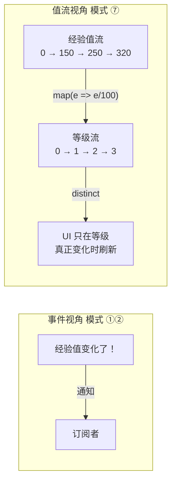

# Extra · 响应式 Observable 完全指南

> 目标：[全景篇](事件系统架构全景-七种模式对比.md) 模式 ⑦ 的深潜，事件系统七模式的收官篇。
> 前六种模式关心的是"**事件发生**"（按键、死亡、加载完成）；
> 响应式关心的是"**值随时间变化**"——把一个不断变化的量当作**数据流**，
> 用 `map`/`filter`/`distinct` 算子链式加工它。
> 这是 UI 数据绑定的杀手锏，也是引擎里最容易被滥用的模式。练习全部附参考答案。

---

## 1. 视角切换：从"事件"到"值流"

同一个东西的两种叙述：



响应式的核心主张：**与其在每个赋值点手动通知，不如让"数据的依赖关系"声明一次、自动传播**——UI 开发者熟悉的 MVVM/React 状态驱动，源头就是这套思想。

| 术语 | 一句话 | 本系列对应物 |
|---|---|---|
| **Observable 可观察量** | 值流本身 | —— |
| **Observer 观察者** | 收到新值的回调 | 槽/订阅者 |
| **Subject 主体** | 既是 Observable 又能手动推值的"热点" | Signal（模式②） |
| **Behavior/ReactiveProperty** | 带"当前值"的 Subject，新订阅者立刻收到现值 | —— |
| **Subscription 订阅** | 可断开的连接 | Connection |
| **算子 operator** | map/filter/distinct… 流的加工管线 | —— |

> 💡 Signal（模式②）和 Subject 的区别就一句话：**Signal 是"事件发生了"（fire-and-forget），Subject 是"值现在是 X"（有当前态、可组合）**。行为差异在订阅时机——晚订阅 Subject 的人也能拿到当前值，晚 connect Signal 的人错过就是错过了。

---

## 2. MiniSubject：自研最小实现（C++17）

📦 `src/reactive.hpp`：

```cpp
#pragma once
// reactive.hpp —— 迷你响应式：Subject / 映射 / 去重（C++17）
#include <algorithm>
#include <functional>
#include <memory>
#include <utility>
#include <vector>

namespace mini {

// ── 订阅令牌：RAII 退订 ─────────────────────────────────────────
class Subscription {
public:
    Subscription() = default;
    Subscription(std::function<void()> unsubscribe)
        : m_unsubscribe(std::move(unsubscribe)) {}
    ~Subscription() { if (m_unsubscribe) m_unsubscribe(); }
    Subscription(const Subscription&) = delete;
    Subscription& operator=(const Subscription&) = delete;
    Subscription(Subscription&& o) noexcept
        : m_unsubscribe(std::move(o.m_unsubscribe)) { o.m_unsubscribe = nullptr; }
    void unsubscribe() {
        if (m_unsubscribe) { m_unsubscribe(); m_unsubscribe = nullptr; }
    }
private:
    std::function<void()> m_unsubscribe;
};

// ── Subject<T>：可推值的流（= 多播 + 快照遍历，同 Signal/Slot §5 思路）──
template <typename T>
class Subject {
public:
    virtual ~Subject() = default;

    Subscription subscribe(std::function<void(const T&)> observer) {
        m_observers.push_back(std::move(observer));
        auto* obs = &m_observers.back();
        return Subscription([this, obs] { unsubscribe(obs); });
    }

    virtual void next(const T& value) {          // 推一个新值进流
        auto snapshot = m_observers;             // 快照：回调里退订不影响本轮
        for (const auto& ob : snapshot) ob(value);
    }

protected:
    void unsubscribe(const std::function<void(const T&)>* obs) {
        // std::function 不可比较 → 按"槽位地址"标记删除
        for (auto& o : m_observers)
            if (&o == obs) { o = nullptr; }
        m_observers.erase(std::remove(m_observers.begin(), m_observers.end(), nullptr),
                          m_observers.end());
    }
    std::vector<std::function<void(const T&)>> m_observers;
};

// ── ReactiveProperty<T>：带当前值的 Subject（Behavior）──────────
template <typename T>
class ReactiveProperty : public Subject<T> {
public:
    explicit ReactiveProperty(T initial) : m_value(std::move(initial)) {}

    // 读值：像普通属性一样用
    const T& value() const { return m_value; }
    operator const T&() const { return m_value; }

    // 写值：只有变了才推流（内置 distinct-until-changed）
    ReactiveProperty& operator=(T v) {
        if (v != m_value) {
            m_value = std::move(v);
            this->next(m_value);                 // 自动传播给所有观察者
        }
        return *this;
    }

    // 晚订阅者立刻拿到当前值（与裸 Subject 的本质区别）
    Subscription subscribe(std::function<void(const T&)> observer) {
        observer(m_value);                       // 先补发当前值
        return Subject<T>::subscribe(std::move(observer));
    }

private:
    T m_value;
};

// ── 算子：map（映射出一条新流）──────────────────────────────────
template <typename T, typename F>
auto map(const Subject<T>& source, F transform)
    -> Subject<decltype(transform(std::declval<T>()))>&
{
    using U = decltype(transform(std::declval<T>()));
    auto* out = new Subject<U>();                // 教学版：裸 new，见练习 4 的所有权问题
    source.subscribe([out, transform](const T& v) { out->next(transform(v)); });
    return *out;
}

}  // namespace mini
```

用法（全景篇 ⑦ 节例子的落地版）：

```cpp
mini::ReactiveProperty<int> playerExp{0};
std::vector<int> levelLog;

playerExp.subscribe([&](const int& exp) {
    levelLog.push_back(exp / 100);               // 经验 → 等级
});

playerExp = 150;      // levelLog: {0(初始), 1}
playerExp = 250;      // levelLog: {..., 2}
playerExp = 250;      // 值没变 → 不推送（distinct 内置）
```

### 2.1 实现要点回放

| 设计 | 原因 | 出处 |
|---|---|---|
| 快照遍历 | 回调里退订不炸迭代器 | Signal/Slot §5.1 |
| `Subscription` RAII | 观察者析构自动退订 | ScopedConnection |
| `ReactiveProperty` 赋值时先判不等 | 内置去重，避免无意义刷新 | Rx `distinctUntilChanged` |
| 晚订阅补发当前值 | UI 后挂也能显示正确初值 | Rx `BehaviorSubject` |

---

## 3. 链式管线：声明依赖，自动传播

`map` 返回的还是 Subject，于是可以继续接——**依赖图**就此成型：

```cpp
mini::ReactiveProperty<float> health{100.f};
mini::ReactiveProperty<float> maxHealth{100.f};

// 依赖链：health/maxHealth → 血量百分比 → UI
// 百分比 = health / maxHealth，任何一边变都自动重算
auto ratio = [&]{
    static mini::Subject<float> out;
    auto recompute = [&]{ out.next(health / maxHealth); };
    health.subscribe([recompute](const float&){ recompute(); });
    maxHealth.subscribe([recompute](const float&){ recompute(); });
    return out;
}();

ratio.subscribe([](const float& r) {
    healthBar.setWidth(r * barPixelWidth);       // 血条自动跟着走
});

health = 75.f;       // 血条 → 75%
maxHealth = 150.f;   // 血条 → 50%（分母变了也自动重算！）
```

这段代码展示响应式真正的胜负手：**"百分比依赖两个源"这个事实声明一次，之后任何一条源变化都自动传播**。命令式写法要在 health 和 maxHealth 的每个赋值点都记得调 `updateHealthBar()`——漏一处就是"血条不同步"这种祖传 bug。

> ⚠️ 上面的 `static mini::Subject<float> out` 是教学偷懒（进程级单例）。正式写法见练习 4 的 `Derived<T>`（带所有权的多源派生流）。

---

## 4. 引擎实战：ImGui 双向绑定

调试面板（[进阶 05](../advanced/05-集成ImGui.md)）是响应式的天选场景——低频、UI 绑定密集：

```cpp
// 引擎侧：清屏色是响应式属性
mini::ReactiveProperty<float> clearColor[3]{ {0.1f}, {0.2f}, {0.3f} };

// 订阅：任何来源改色，渲染自动跟随
clearColor[0].subscribe([&](const float& r){ m_clearR = r; });
// ...

// ImGui 侧：滑块写属性 → 自动传播；代码改属性 → 滑块下帧显示新值
ImGui::ColorEdit3("Clear color", clearColor);   // 简化示意：内部写 ReactiveProperty
```

双向绑定的环（滑块 → 属性 → UI 刷新 → 滑块……）被 `ReactiveProperty` 的**内置去重**天然切断：滑块推同一个值进来，属性判断"没变"就不再广播。这是"响应式 UI 框架都内置 distinct"的原因。

---

## 5. 与模式②的边界、以及为什么引擎不全用它

| | Signal/Slot（②） | Observable（⑦） |
|---|---|---|
| 语义 | 事件发生（无当前态） | 值的演变（有当前态、可查初值） |
| 订阅者晚到 | 错过就错过 | 补发当前值 |
| 可组合性 | 弱（广播列表） | **强（map/filter/merge/combinelatest）** |
| 分配 | 每连接一次 | **每个算子节点一次**（管线越长节点越多） |
| 调试 | 断点直读 | 堆栈在算子链里穿行，困难 |
| 高频（60Hz 鼠标） | 可用 | ❌ 每次推流穿全链，性能与 GC 压力大 |

所以全景篇的结论在此展开为三条实用律：

1. **UI 属性绑定 → ⑦**（ReactiveProperty 一统设置项、血条、调试面板）；
2. **模块间点对点通知 → ②**（`onTextureLoaded`）；
3. **每帧高频流 → 谁都不用**，直接轮询状态（拉模型完胜：`if (input.isKeyDown(...))`）。

---

## 6. 陷阱清单

1. **订阅泄漏**：订阅时捕获了 `[&]` 大对象、令牌随手丢弃——观察者列表越积越肥。Subscription 必须有主（成员变量），生命周期 = 观察者生命周期。
2. **回调里改自己**：`health = 50` 的回调里再 `health = 30` → 同一轮内二次传播，容易振荡。改别的属性触发间接回流也一样。规则：**回调只做"读源写下游"，不要写上游**。
3. **重入与顺序依赖**：A、B 都订阅 health，A 的回调改了 B 依赖的另一个属性——B 到底看到哪个版本取决于订阅顺序。多源派生统一走 §3 的"派生节点"而不是"回调里互相改"。
4. **整条链的线程假设**：MiniSubject 无锁。所有 next() 必须同线程（UI 线程）；跨线程源先过 [EventQueue 篇 §5](事件队列EventQueue完全指南.md) 的队列弹回主线程再推流。
5. **把"状态"当"流"**：`isAlive` 这种持续状态做订阅，每帧都可能推 N 次"还是活的"。持续状态用查询（拉），**边沿变化**（从活到死那一次）才推流。

---

## 🔧 练习

1. **血条三连**：用 `ReactiveProperty<float>` 的 health/maxHealth 实现"血量百分比 = health/maxHealth"派生，要求（a）任一源变化都刷新（b）初始订阅立即显示正确百分比（c）百分比不变（如 50/100→75/150）不通知 UI。
2. **输出预测**（不许跑代码，基于 §2 实现）：
   ```cpp
   mini::Subject<int> s;
   int log = 0;
   {
       auto sub = s.subscribe([&](const int& v) { log += v; });
       s.next(1);
       sub.unsubscribe();
       s.next(2);
   }
   auto sub2 = s.subscribe([&](const int& v) { log *= v; });
   s.next(3);
   std::cout << log;
   ```
   输出多少？
3. **实现 `filter` 算子**：`filtered = filter(source, pred)` 只让满足谓词的值通过。用它把"原始鼠标事件流"过滤成"仅右键按下流"。
4. **修 `map` 的所有权**：§2 的 `map` 裸 `new` 且永不释放，返回引用也无法确定生命周期。实现 `Derived<T>`：持有自己的 Subject + 内部 Subscription，值语义可存成员，析构自动断开源。
5. **设计题**：引擎设置面板有 20 个滑块（音量、FOV、灵敏度……），设置可被（a）滑块（b）加载存档（c）默认值初始化 三处修改，各 UI 与引擎系统都要跟随。比较"每个滑块 3 处手动同步"与"每项一个 ReactiveProperty"的实现代价，并指出哪些系统不适合响应式化（提示：渲染管线内部）。

---

## 📝 参考答案

### 1. 血条三连

```cpp
mini::ReactiveProperty<float> health{100.f};
mini::ReactiveProperty<float> maxHealth{100.f};

class HealthRatio {
public:
    HealthRatio(decltype(health)& h, decltype(maxHealth)& m)
        : m_h(h), m_m(m) {
        auto recompute = [this] { push(); };
        m_subH = h.subscribe([recompute](const float&){ recompute(); });
        m_subM = m.subscribe([recompute](const float&){ recompute(); });
        m_property = current();                 // 初始即正确
    }
    mini::Subscription subscribe(std::function<void(float)> ob) {
        return m_property.subscribe(std::move(ob));
    }
private:
    float current() const { return m_h / m_m; }
    void push() { m_property = current(); }     // 去重内置：50% → 50% 不通知
    mini::ReactiveProperty<float> m_property{0.f};
    mini::Subscription m_subH, m_subM;
    decltype(health)& m_h;
    decltype(maxHealth)& m_m;
};

HealthRatio ratio(health, maxHealth);
ratio.subscribe([](float r){ healthBar.setWidth(r * 300); });
// 验证：(a) maxHealth=150 → 血条 66.7%→… 自动重算
//      (b) 构造后立即订阅也拿到当前值（ReactiveProperty 补发）
//      (c) 50/100 → 75/150：current() 都是 0.5，赋值判等跳过 → 不通知
```

(c) 是本题的隐藏考点：**去重要放在派生属性上**（算完再判），而不是在源上判——源明明变了，是派生值没变。

### 2. 输出预测

输出 **`9`**。

过程：`log=0` → 订阅A → `next(1)`：log=1 → A 退订 → `next(2)`：无人收 → 作用域出，sub 析构（已退订，二次退订安全——unsubscribe 后 m_unsubscribe 已置空）→ 订阅B（乘法）→ `next(3)`：log=1*3=3？

不对——注意 B 的回调是 `log *= v`，但 B 订阅时 `ReactiveProperty` 才补发……这里 `s` 是裸 `Subject`（非 ReactiveProperty），**不补发当前值**——这是本题考点。所以输出是 **3**。

### 3. filter 算子

```cpp
template <typename T, typename F>
Subject<T>& filter(const Subject<T>& source, F predicate) {
    auto* out = new Subject<T>();                       // 所有权问题同 map，见练习 4
    source.subscribe([out, predicate](const T& v) {
        if (predicate(v)) out->next(v);                 // 不满足 → 吞掉
    });
    return *out;
}

// 用法：原始输入流 → 仅右键按下
struct MouseEvent { int button; int action; int mods; };
Subject<MouseEvent> mouse;
auto& rightDown = filter(mouse, [](const MouseEvent& e) {
    return e.button == 1 && e.action == GLFW_PRESS;
});
rightDown.subscribe([](const MouseEvent&) { contextMenu.open(); });
```

### 4. Derived：值语义的派生流

```cpp
template <typename T>
class Derived {
public:
    Derived(mini::Subject<T>& source, std::function<T()> compute)
        : m_compute(std::move(compute)), m_property(m_compute()) {
        m_sub = source.subscribe([this](const T&) { push(); });
    }
    // 多源版：接受 vector<Subject<T>*>，或每个源一条 Subscription（练习扩展）
    mini::Subscription subscribe(std::function<void(const T&)> ob) {
        return m_property.subscribe(std::move(ob));
    }
    const T& value() const { return m_property.value(); }
private:
    void push() { m_property = m_compute(); }
    std::function<T()> m_compute;
    mini::ReactiveProperty<T> m_property;
    mini::Subscription m_sub;        // 持有 → Derived 死则断开源订阅，无泄漏
};

// 用法：map 的问题版本可以改写成
Derived<float> ratioSrc(health, [&]{ return health / maxHealth; });   // 单源订阅 + 闭包读双源
```

要点：`m_sub` 成员持有订阅（RAII）、`ReactiveProperty` 提供去重与补发、`Derived` 本身值语义可当成员/局部变量——三个性质凑齐，就是"能上生产的 map"。

### 5. 设计题

手动同步的代价：3 个修改源 × 20 项 × N 个跟随方，每加一个跟随方（比如新加的 HUD）都要在 60 个修改点全部补通知——组合爆炸，且编译器不查漏。响应式版本：20 个 `ReactiveProperty` + 每个跟随方一条 `subscribe`，修改源只要写属性，**新增跟随方零接触修改点**（开闭原则的回调形态）。存档加载 = 批量赋值属性，天然复用传播路径。

不适合响应式的：渲染管线内部状态（当前 pass、绑定的纹理）——高频、顺序敏感、单线程局部变量就够，套属性传播纯属自虐；还有物理仿真的中间量——它们不是"UI 可观察属性"，是每帧重算的临时数据（那是 §5 第 3 条"拉模型"的领地）。

---

## 参考资料

- [ReactiveX — Observable（概念总纲）](http://reactivex.io/documentation/observable.html)（map/filter/distinct 算子语义的权威定义）
- [RxCpp](https://github.com/ReactiveX/RxCpp)（C++ 的完整 Rx 实现；本篇 Mini 版是其 1% 子集）
- [信号槽指南 §5](Signal-Slot信号槽完全指南.md)（快照遍历/RAII 令牌的实现原理，本篇直接复用）
- [进阶 05 集成 ImGui](../advanced/05-集成ImGui.md)（§4 调试面板的宿主）
- [进阶 07 性能与多线程](../advanced/07-性能与多线程.md)（为什么高频流别走推模型）

---

> 七种模式到此收官。回到 [事件系统架构全景](事件系统架构全景-七种模式对比.md) 复盘选型，或回 [教程主页](../README.md)。
