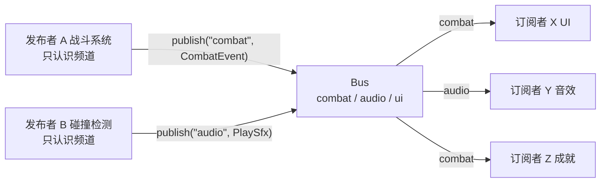

# Extra · 消息总线 MessageBus 完全指南

> 目标：[全景篇](事件系统架构全景-七种模式对比.md) 模式 ⑤ 的深潜。
> 前四种模式里，发布者和订阅者总有一方要认识对方（认识信号对象 / 认识 dispatcher / 认识队列）。
> 消息总线走到底：**双方只认识"频道"这个字符串（或类型），互相彻底匿名**。
> 这是解耦的天花板，也是 spaghetti 的起跑线——本篇把两个方向都讲清楚。
> 练习全部附参考答案。

---

## 1. 模型：一切经过总线



A 不知道 X/Y/Z 存在；X/Y/Z 也不知道 A/B 存在——只认识频道。

与模式①的分界：① 是「**编译期类型**路由」（`dispatch<KeyPressedEvent>`），⑤ 是「**运行期字符串/类型键**路由」。与模式⑥的关系：EnTT dispatcher 本质是"按 `type_index` 路由的总线"（见 [ECS 篇](ECS事件系统完全指南.md)），本篇的强类型版与它同构。

---

## 2. 两种总线：弱类型 vs 强类型

### 2.1 弱类型版（字符串频道 + 类型擦除）

最"总线"的总线——频道是字符串，载荷是 `std::any`：

```cpp
#include <any>
#include <functional>
#include <string>
#include <unordered_map>
#include <vector>

class MessageBus {
public:
    using Handler = std::function<void(const std::any&)>;

    void subscribe(const std::string& channel, Handler h) {
        m_channels[channel].push_back(std::move(h));
    }

    template <typename T>
    void publish(const std::string& channel, T msg) {
        auto it = m_channels.find(channel);
        if (it == m_channels.end()) return;
        for (auto& h : it->second)
            h(std::any(msg));            // 擦进 any，订阅方自己 any_cast 回来
    }

private:
    std::unordered_map<std::string, std::vector<Handler>> m_channels;
};

// 用法：发布方
bus.publish("combat", CombatEvent{playerId, enemyId, 42.5f});

// 用法：订阅方（必须约定好载荷类型，cast 错 = 异常）
bus.subscribe("combat", [](const std::any& payload) {
    auto& e = std::any_cast<const CombatEvent&>(payload);
    ui.showDamageNumber(e.damage);
});
```

特点：**运行期完全动态**（新频道 = 新字符串，热重载脚本也能发消息）、但类型安全全靠人肉约定，`any_cast` 失败运行期爆炸，性能最差（字符串 hash + any 拷贝 + 虚调用）。

### 2.2 强类型版（按事件类型路由——推荐默认）

把"频道"从字符串换成 `std::type_index`，载荷不擦除。类型安全回到编译期，性能高一个档次：

📦 `src/message_bus.hpp`：

```cpp
#pragma once
// message_bus.hpp —— 强类型消息总线（C++17）
#include <functional>
#include <memory>
#include <mutex>
#include <typeindex>
#include <unordered_map>
#include <vector>

class MessageBus {
public:
    // 订阅：按事件类型。返回 RAII 令牌，析构自动退订。
    template <typename EventT>
    [[nodiscard]] Subscription subscribe(std::function<void(const EventT&)> handler) {
        auto& list = channels(typeid(EventT));
        list.push_back(std::move(handler));
        return Subscription{ this, typeid(EventT), list.size() - 1 };
    }

    // 发布：同步调用所有该类型的订阅者（顺序 = 订阅顺序）
    template <typename EventT>
    void publish(const EventT& event) {
        auto it = m_channels.find(typeid(EventT));
        if (it == m_channels.end()) return;
        // 快照遍历：handler 里退订/再订阅不影响本轮
        auto handlers = it->second;
        for (auto& h : handlers)
            h(reinterpret_cast<const std::any&>(event));   // 见下方说明
    }

private:
    // Subscription 需要访问 erase —— 交给嵌套类
    struct Channel {
        std::vector<std::function<void(const std::any&)>> handlers;
    };
    ...
};
```

——先停一下。上面的 `reinterpret_cast` 是危险写法，正好用来引出本篇最重要的实现课题：

> ⚠️ **异类型 handler 存进同一条 `vector` 必须类型擦除，而"擦成什么"决定了安全等级。**
> 擦成 `std::any`（弱类型版）= 订阅方 cast 回来，运行期检查；
> 擦成 `std::function<void(const void*)>` + 存 `type_index` 做发布前比对 = 无 cast、无拷贝，且发布端和订阅端类型不一致时**根本匹配不上**（找不到频道），不会错配调用。

完整、正确的实现（按这个方案）：

```cpp
#pragma once
// message_bus.hpp —— 强类型消息总线（C++17）正确版
#include <cstdint>
#include <functional>
#include <typeindex>
#include <unordered_map>
#include <vector>

class MessageBus {
public:
    // RAII 订阅令牌：析构自动退订
    class Subscription {
    public:
        Subscription() = default;
        Subscription(MessageBus* bus, std::type_index type, std::uint64_t id)
            : m_bus(bus), m_type(type), m_id(id) {}
        ~Subscription() { if (m_bus) m_bus->unsubscribe(m_type, m_id); }
        Subscription(const Subscription&) = delete;
        Subscription& operator=(const Subscription&) = delete;
        Subscription(Subscription&& o) noexcept
            : m_bus(o.m_bus), m_type(o.m_type), m_id(o.m_id) { o.m_bus = nullptr; }
    private:
        MessageBus* m_bus = nullptr;
        std::type_index m_type = typeid(void);
        std::uint64_t m_id = 0;
    };

    template <typename EventT>
    [[nodiscard]] Subscription subscribe(std::function<void(const EventT&)> handler) {
        auto& channel = m_channels[typeid(EventT)];
        std::uint64_t id = ++m_nextId;
        // 擦除：把 void(const EventT&) 包成 void(const void*)
        channel.push_back({ id,
            [h = std::move(handler)](const void* p) {
                h(*static_cast<const EventT*>(p));
            } });
        return Subscription{ this, typeid(EventT), id };
    }

    template <typename EventT>
    void publish(const EventT& event) const {
        auto it = m_channels.find(typeid(EventT));
        if (it == m_channels.end()) return;
        auto handlers = it->second;          // 快照：handler 内退订不影响本轮
        for (const auto& slot : handlers)
            slot.fn(static_cast<const void*>(&event));   // 零拷贝、零 cast
    }

private:
    friend class Subscription;
    void unsubscribe(std::type_index type, std::uint64_t id) {
        auto it = m_channels.find(type);
        if (it == m_channels.end()) return;
        auto& v = it->second;
        v.erase(std::remove_if(v.begin(), v.end(),
                    [id](const Slot& s) { return s.id == id; }),
                v.end());
    }
    struct Slot {
        std::uint64_t id;
        std::function<void(const void*)> fn;
    };
    std::unordered_map<std::type_index, std::vector<Slot>> m_channels;
    std::uint64_t m_nextId = 0;
};
```

用法（注意和弱类型版对比——没有频道字符串，没有 `any_cast`）：

```cpp
struct CombatEvent { int player, enemy; float damage; };
struct LevelLoaded { int levelId; };

MessageBus bus;
{
    auto sub = bus.subscribe<CombatEvent>([](const CombatEvent& e) {
        ui.showDamageNumber(e.damage);           // 直接拿到强类型引用
    });
    bus.publish(CombatEvent{1, 7, 42.5f});       // ✅ 触发
}                                                // sub 析构 → 自动退订
bus.publish(CombatEvent{2, 8, 10.f});            // ✅ 安全：无人订阅，静默返回
```

**发布 `CombatEvent` 永远不可能路由到 `LevelLoaded` 的订阅者**——频道键就是类型本身，类型不匹配连频道都找不到。这是强类型版相对弱类型版的核心优势。

---

## 3. 版本对比与选型

| | 弱类型（string + any） | 强类型（type_index） |
|---|---|---|
| 类型安全 | 运行期（`any_cast` 可能炸） | **编译期 + 路由即类型** |
| 新增消息 | 新字符串即可，**不改总线代码**，脚本/热更可发 | 新 struct，需要重编译 |
| 性能 | 字符串 hash + any 拷贝 | type_index hash + 零拷贝 |
| 可发现性 | 极差（频道名散落字符串字面量） | 好（grep 事件类型即可） |
| 载荷形状 | 任意（any） | 固定 struct |
| 适合 | 编辑器插件、脚本桥、mod 接口 | 引擎内部模块边界 |

> 💡 实践配方：**引擎内部用强类型版；只在"外部世界接入"的边界（脚本、mod、网络消息）加一层字符串 ↔ 类型 的翻译**。两头的好处都拿到。

---

## 4. 调试：总线最大的税

匿名 = 断点难打。三条必配的调试基础设施：

1. **Trace 钩子**：总线加一个全局观察者，所有发布先过它：

```cpp
bus.setTrace([](std::type_index type, const void*) {
    std::cout << "[bus] " << type.name() << '\n';   // 谁、何时、发了什么
});
```

2. **频道体检**：`dump()` 列出每个类型几个订阅者——"为什么我没收到"九成是订阅者已析构（没退订成功）或类型写错（`const EventT&` vs `EventT&` 的 `typeid` 不同！）。
3. **命名**：事件类型命名统一 `XxxEvent`/`OnXxx`，发布点统一走 `bus.publish`，保证 grep 单一入口。

---

## 5. 反模式清单（什么时候不要用总线）

全景篇的警告值得展开成 checklist——出现以下任一情况，退回模式①②：

- ❌ **需要返回值/表决**：总线单向匿名，没有回程。要结果用直接调用或 AccumulateSignal。
- ❌ **需要时序保证**：总线 publish 是同步的但顺序=订阅顺序，没人该依赖它；要时序去模式④。
- ❌ **两个模块强耦合地来回对话**：A 发 B 收、B 立刻回 A 又收……这对应该是一个直接函数调用，经总线只是把调用栈藏起来。
- ❌ **高频每帧消息**（鼠标移动 60Hz 经总线）：字符串/哈希/间接调用的开销乘以帧率。高频走 Signal（模式②）。
- ✅ **正确用法**：模块边界的低频、粗粒度通知——"关卡加载完了""存档成功了""设置变了"。

---

## 6. 线程安全与延迟变体

- `publish`/`subscribe` 加一把 `std::mutex` 粗粒度锁即可（总线消息频率低）；对性能敏感就学 [EventQueue 篇 §5](事件队列EventQueue完全指南.md) 的"锁内 swap"。
- **总线 + 队列 = 延迟总线**：`publish` 只入队，主循环固定点 `bus.flushAll()` 统一派发——模式⑤借模式④的时序解耦。EnTT 的 `enqueue()+update()` 就是这个形态（[ECS 篇](ECS事件系统完全指南.md)）。

---

## 🔧 练习

1. **接入你的引擎**：用强类型版 `MessageBus` 把「窗口关闭」广播出去：`GLFWManager` 在 closeCallback 里 `publish(WindowClosedEvent{})`，`main` 的主循环订阅后置退出标志。订阅句柄的生命周期要注意什么？
2. **找 bug**：下面代码哪里会在运行期出错？为什么？
   ```cpp
   MessageBus bus;
   struct Ping { int id; };
   bus.subscribe<Ping>([](Ping& p) { std::cout << p.id; });   // (1)
   bus.publish(Ping{42});                                     // (2)
   ```
3. **实现 trace + dump**：给 §2.2 的 `MessageBus` 加 `setTrace(TraceFn)`（publish 时回调：类型名 + 订阅者数）和 `dump()`（打印每频道订阅者数量）。要求 trace 在快照遍历之前执行。
4. **延迟总线**：给 `MessageBus` 加 `publishDeferred<E>(e)`（入队）与 `flush()`（把队列里的事件逐个走 `publish`）。要求：flush 期间 `publishDeferred` 的新事件进入**下一轮**（提示：swap 两份队列）。
5. **设计题**：某团队抱怨"总线化之后谁都不敢删任何事件类型，也查不清谁在发"。给出至少三条工程治理手段。

---

## 📝 参考答案

### 1. 接入引擎

```cpp
struct WindowClosedEvent {};

// main.cpp
MessageBus bus;
bool running = true;
auto sub = bus.subscribe<WindowClosedEvent>([&](const WindowClosedEvent&) {
    running = false;                       // 只置标志，真正清理在循环外
});

while (running && !window.shouldClose()) {
    window.pollEvents();                   // closeCallback 内部 publish(WindowClosedEvent{})
    /* update / render */
}
// ⚠️ 关键：sub 声明在 while 之前且活到 while 之后——
// 令牌先于 bus 或先于循环析构，都会导致"收不到关闭事件"或析构顺序问题。
```

生命周期注意点：① `Subscription` 是 RAII，谁订阅谁持有（main 的栈变量）；② 它必须在 `bus` 之后析构（成员顺序/声明顺序保证）；③ 若订阅者是个类，令牌做成成员即可。

### 2. 找 bug

(1) 处编译通过不了——或者换个角度：(1) 的签名是 `void(Ping&)`，而 `subscribe<Ping>` 要求 `void(const Ping&)`，`std::function` 转换失败，**编译错误**。
假设把 (1) 改对了，还有第二层坑：订阅端擦除时 `static_cast<const Ping*>`，若有人用 `publish(NonConstPing)` 之类相近类型，`typeid` 不匹配只会"静默无人接收"——这正是强类型总线的保护方式：**类型不匹配 = 找不到频道，而不是错误调用**。所以本题答案：错误在编译期就被拦下（强类型版的价值所在）；若同样的笔误发生在弱类型版（频道名字符串打错），则要等到运行期"消息消失"才暴露。

### 3. trace + dump

```cpp
// 成员与类型
using TraceFn = std::function<void(const char* typeName, std::size_t subscribers)>;

void setTrace(TraceFn t) { m_trace = std::move(t); }

template <typename EventT>
void publish(const EventT& event) const {
    auto it = m_channels.find(typeid(EventT));
    std::size_t n = (it == m_channels.end()) ? 0 : it->second.size();
    if (m_trace) m_trace(typeid(EventT).name(), n);   // ① 先 trace
    if (it == m_channels.end()) return;
    auto handlers = it->second;                       // ② 再快照
    for (const auto& slot : handlers) slot.fn(static_cast<const void*>(&event));
}

void dump() const {
    for (const auto& [type, slots] : m_channels)
        std::cout << type.name() << ": " << slots.size() << " subscriber(s)\n";
}
```

trace 放快照前：保证"消息即将发给 N 人"这个数字反映的是发布时刻的订阅数，不受本轮 handler 退订影响。

### 4. 延迟总线

```cpp
struct Deferred { std::function<void()> deliver; };

template <typename EventT>
void publishDeferred(const EventT& e) {
    // 把"强类型 publish"打包成擦除的投递闭包入队
    EventT copy = e;                                   // 自持拷贝！
    m_deferred.push_back([this, copy = std::move(copy)] {
        publish(copy);
    });
}

void flush() {
    std::vector<std::function<void()>> round;
    round.swap(m_deferred);                            // swap：本轮/下轮隔离
    for (auto& deliver : round) deliver();             // 期间 publishDeferred → 下轮
}
```

三个考点：事件必须**拷贝进闭包**（队列存活期超过调用栈）；**swap-then-flush**（同 [EventQueue 篇练习 2](事件队列EventQueue完全指南.md)，flush 中新入队的下一轮再发）；`flush` 里走的是常规 `publish`，trace/快照语义自动继承。

### 5. 设计题（工程治理）

1. **事件类型集中注册**：所有事件 struct 收进 `events/` 目录 + 一张表（文件/类型/载荷/谁发谁收），code review 按表审。类型成了 API，就有 API 的管法。
2. **发布点收口**：禁止业务代码直接摸 `bus`，只暴露 `events::publishLevelLoaded()` 这类具名函数——grep 单一入口，删事件时编译器全量报引用。
3. **trace 常开 + 频道体检 CI**：测试里 dump 总线，快照比对订阅者数量变化，"谁在偷偷订阅"无所遁形。
4. **加 TTL/Owner 标签**：每类事件标注 owner 团队与废弃日期（`[[deprecated]]` 事件类型），敢删。
5. **定期"总线瘦身"评审**：把"来回对话"型的频道合并回直接调用（§5 反模式），总线只留单向通知。

---

## 参考资料

- [Game Programming Patterns — Event Queue](https://gameprogrammingpatterns.com/event-queue.html)（"central event bus"一节：全局总线的诱惑与代价）
- [Game Programming Patterns — Observer](https://gameprogrammingpatterns.com/observer.html)（总线是 Observer 的全局化形态）
- [EnTT Wiki — Event dispatcher](https://github.com/skypjack/entt/wiki/Events,-Signals-and-Everything-in-Between)（type_index 路由总线的工业实现，本篇强类型版同构）
- [事件队列 EventQueue 完全指南](事件队列EventQueue完全指南.md)（延迟变体与线程安全的详细版）
- [Signal/Slot 信号槽完全指南](Signal-Slot信号槽完全指南.md)（高频点对点场景的替代方案）

---

> 下一篇 Extra（事件系统模式专题）👉 [ECS 事件系统完全指南](ECS事件系统完全指南.md)（模式 ⑥）
